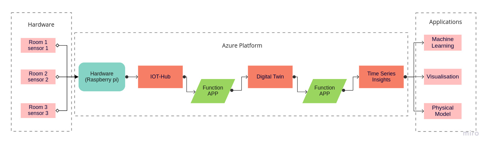
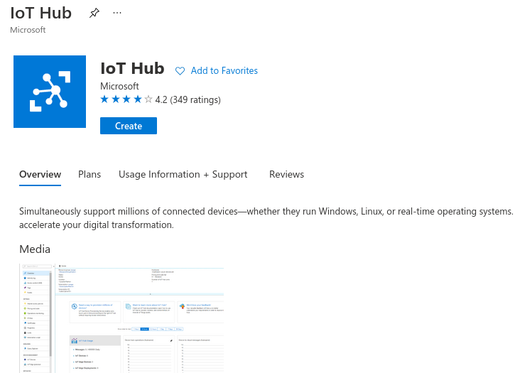
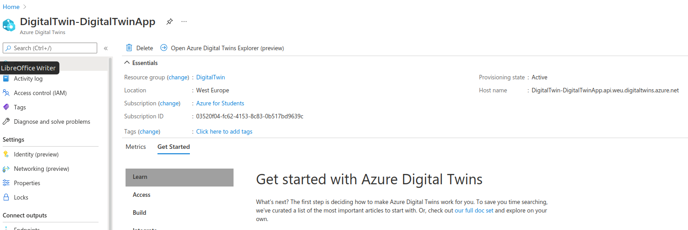
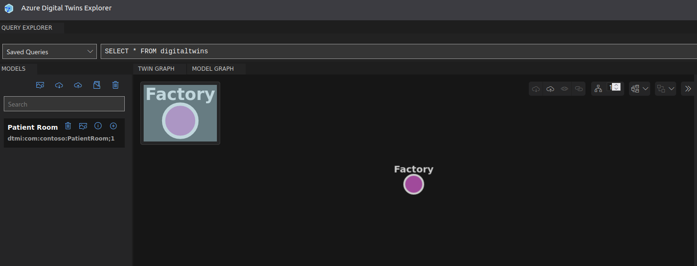

# Digital Twin Airquality For Covid Risk Assessment

## Using Microsoft Azure Cloud Service

#### Author: Hari Shankar

#### Last updated July 5, 2021

## Contents

- 1 Introduction 
   - 1.1 Project Road Map
   - 1.2 Raspberry Pi
   - 1.3 Using Raspberry pi on our project
- 2 Setup: Microsoft Azure
   - 2.1 Create Account
   - 2.2 Install Azure CLI on your PC
   - 2.3 IoT Hub App
      - 2.3.1 Creating the hub app
      - 2.3.2 Usage and further info
   - 2.4 Create Digital Twins Platform
      - 2.4.1 Digital Twin Explorer
      - 2.4.2 To connect DT explorer to your Azure DT:
      - 2.4.3 Creating and uploading the model
   - 2.5 Local development with Azure
      - 2.5.1 Azure in Visual Studio
      - 2.5.2 Visual Studio Code Azure Extension
   - 2.6 Azure library for Python on Raspberry Pi
   - 2.7 Setup Debug Environment for Azure Functions in Visual Studio
   - 2.8 Physical Model
   - 2.9 Machine Learning
   - 2.10 Visualisation

# Chapter 1

# Introduction
### 1.1 Project Road Map

In this section we will discuss about how our project is planned, its working architecture and
data flow. Azure is the things we concentrate on more here as Hardware setup is explained
earlier now its time to concentrate on azure part where this is the place the data is arrived and
plans for further computations.

First a ”Data Receiving point” IOT hub will be created, then a Digital Twins platform will
be created were data flows through it for sake of visualising the entire sensor archetechture. A
related documentation is part of the linked [Quickstart](https://docs.microsoft.com/en-us/azure/digital-twins/quickstart-adt-explorer).

### 1.2 Raspberry Pi

There were already some [Raspberry](https://www.raspberrypi.org/products/raspberry-pi-4-model-b/) boards at the CDL available, so it was an easy
decision to go for this hardware platform. Other platforms would be Arduino or even smaller
and cheaper boards, because of the low requirements for this Use-Case.
Required hardware:

- Raspberry Pi 4
- Power adapter for Raspberry Pi 4 (USB-C)
- SD-card
- LAN-cable
- Card-Reader (for initialization)
- Keyboard (for initialization)
- Micro-HDMI to HDMI cable (for initialization)

### 1.3 Using Raspberry pi on our project
We can simulate the data in two ways, either in Simulated data or Actual data. Mostly simulated data will be used for checking purpose. 
For More information about Actual data [click here for actual data](https://github.com/derlehner/DigitalTwin_Airquality_For_Covid_Risk_Assessment/tree/development/raspberry/actual_data).
For more information on simulated data [click here for Simulated data](https://github.com/derlehner/DigitalTwin_Airquality_For_Covid_Risk_Assessment/tree/development/raspberry/simulated_data).

# Chapter 2

# Setup: Microsoft Azure

Microsoft Azure is a cloud solution with a lot of recources and services. The once that are
interessting for this project and are covered by this documentation. The following sections
describe the relevant steps to get an Azure Setup needed for this project. All information
covered by this chapter are also covered by the documentation of Microsoft. The links with the
related steps will be linked in the footnodes.

### 2.1 Create Account

It is possible to get a free Microsoft Azure account, but it is recommended to create an Microsoft
Azure student account, because it will apply$100 credit to the account.
To create an Microsoft Azure student account it is necessary to have 2 different e-mail
addresses:

- The academic e-mail address (@jku.at) to verify you are eligible or the student account,
- another e-mail address, that will be used as login and main e-mail address for Azure.

[This Link](https://azure.microsoft.com/en-us/free/students/) leads to the sign-up page of Microsoft Azure for Students. To start,
the ”Activate now” button needs to be pressed. Then you need to sign in with an existing
Microsoft account or create a new one, but keep in mind that you do not use your academic
e-mail address. While following the sign-in instructions you will need to state your country
and date of birth. Furthermore you will need to confirm your e-mail address by entering a
verification code which will be sent to you (watch your Spam folder). If everything is fine you
have a new Microsoft account incl. Microsoft Azure or you have a new Microsoft Azure account
linked to your existing Microsoft account. Either way in the next step you will need to confirm
your academic status with entering your academic e-mail address. Now you have a new account
and can start with the next steps.

### 2.2 Install Azure CLI on your PC

Azure CLI is available for Windows, macOS and Linux. There is a [related documentation](https://docs.microsoft.com/en-us/cli/azure/install-azure-cli)
available for the different operating systems. After the installation it is possible to access Azure
via terminal with the keywordaz. There are extensions of commands that are related to [Digital Twins](https://docs.microsoft.com/en-us/cli/azure/ext/azure-iot/dt?view=azure-cli-latest) (az dt) and [IoT hub](https://docs.microsoft.com/en-us/cli/azure/iot?view=azure-cli-latest) (az iot).

For working on azure azure CLI is one of recommended thing to be installed on working
device (not on raspi). It can be done using commends below you can find the details:

- Linux by single line command:
    curl -sL https://aka.ms/InstallAzureCLIDeb — sudo bash
- On Windows and Others:
    https://docs.microsoft.com/en-us/cli/azure/install-azure-cli

With Azure CLI it is possible to sign into your Azure account and do most of the steps, that
are possible at the Azure Portal homepage. It is recommended to install Azure CLI because it
is the easiest way to log into your Azure account and some steps are done via Azure CLI in the
documentation. The reference for Azure CLI is [available online](https://docs.microsoft.com/en-us/cli/azure/reference-index?view=azure-cli-latest).

### 2.3 IoT Hub App

This is one of the services which Azure enables highly secure and reliable communication
between your Internet of Things (IoT) application and the devices it manages. Azure IoT Hub
provides a cloud-hosted solution back end to connect virtually any device.

IoT Hub is the entry point to the data which we actually want to work on after receiving here
we have huge options to work on with. We can use the IoT app as a source for other azure
services. In this section an Azure IoT hub will be created. A related documentation is part of
the [linked Quickstart](https://docs.microsoft.com/en-us/azure/iot-hub/quickstart-send-telemetry-python#create-an-iot-hub).

#### 2.3.1 Creating the hub app

1. In the azure resources search for IoT Hub
2. click create
3. Using this required data create the azure app. The required data:
- Resource group
- Resource Locationd
- IOT hub Name

#### 2.3.2 Usage and further info

- Manage IoT Devices (make successful connections for data transfer)
- You can send Telemetry-data securely from physical hardware (sensor) to Azure. For info
    [refer this website](https://docs.microsoft.com/en-us/azure/iot-hub/quickstart-send-telemetry-python)
- Using ‘Message Routhing’ option telemetry messages can be sent to : Events, Storage,
    Event Hubs and much more.

For further info:

- About[ IOT Hub](https://channel9.msdn.com/Shows/Azure-Friday/Azure-IoT-Hub?term=iot)
- For [Device Streaming](https://channel9.msdn.com/Shows/Internet-of-Things-Show/Azure-IoT-Hub-Device-Streams?term=iot)
- IOT to [Event Grid Integration](https://channel9.msdn.com/Shows/Internet-of-Things-Show/IoT-Devices-and-Event-Grid?term=iot)

### 2.4 Create Digital Twins Platform

Azure Digital Twins is an Internet of Things (IoT) platform that enables you to create a digital
representation of real-world things, places, and business processes. Azure Digital Twins is an
IoT platform that enables the creation of comprehensive digital models of entire environments
to gain insights that drive better products, optimization of operations, cost reduction and
breakthrough customer experiences. Examples include buildings, factories.

- Model any environment and bring digital twins to life in a scalable and secure manner.
- Connect assets such as IoT devices as well as existing business systems to Azure Digital
    Twins.

In this section a Digital Twins platform will be created. A related documentation is part of
the [linked Quickstart](https://docs.microsoft.com/en-us/azure/digital-twins/quickstart-adt-explorer).

1. Search for”Azure Digital Twin”in [azure resource](https://portal.azure.com)
2. You will need to press the Button+ Addat the Azure Digital Twins page.
3. At the next page you will have to add
    - a resource group,
    - a location and
    - a name for the Digital Twins service.

In above figure you can find the”Host Name”where you can find in DT homepage is the
string should be noted. It is used further for installing DT Explorer.
The resource group will be later used for all other resources related to the AirQuality project.
It needs to be created, if this wasn’t done before. To do so, press theCreate newbutton
below the Resource group selection. You only need a name or the resource group to do so.
Regarding location, it is worth to mention that the Digital Twins resource is only available
for Australia East, East US, East US 2, North Europe, South Central US, Southeast Asia,
UK South, West Central US, West Europe and West US 2 at the moment. These locations
are the locations of the Azure servers. For the current instance for the AirQuality project the
locationWest Europewas chosen. If everything is filled out, you can continue by clicking the
Review + createbutton at the lower left corner. A short summery to check again will be
listed. By pressing theCreatebutton in the lower left corner you will finish the creation. The
deployment will take some. A window in the upper right corner will show you a message when
completed.

#### 2.4.1 Digital Twin Explorer

Digital Twin Exploreris the easy way to visualise our model architecture, import, export
our models. This should be installed in our pc. Requirements for DT Explorer: Node.js (not
less then version 10), npm. The process to install DT Explorer:

1. Installing node.js on ubuntu by command line:
    sudo a p t i n s t a l l c u r l
       c u r l −sL h t t p s : / / deb. n o d e s o u r c e. com/ s e t u p 1 0. x | sudo −E bash −
    sudo a p t i n s t a l l n o d e j s
2. Download and extract the Digital Twin Explorer files []]:^13
2. Download and extract the Digital Twin Explorer files [from the git]()

3. Run terminal under this directory: digital-twins-explorer-main/client/src
4. Run the command: to install the npm
    npm i n s t a l l
5. Run the command: to start the DT Explorer
    npm run s t a r t

#### 2.4.2 To connect DT explorer to your Azure DT:

1. Copy host name from your Digital twin home page, and add‘https://’ in front for
    example:
    https://DigitalTwin-DigitalTwinApp.api.weu.digitaltwins.azure.net
2. Then click login icon on top right on DT explorer you already opened Paste the string
    here and click ok. You will be now connected to the azure

#### 2.4.3 Creating and uploading the model

1. All dt models should be written in .json file

2. Open your favourite code editor and create new .json file

3. This code above is the example simple model which contains ‘temperature’ and ‘Humid-
    ity’: It is based on azure dtdl language. [More about it](https://docs.microsoft.com/en-us/azure/digital-twins/concepts-models)
4. For uploading click the upload button on DT explorer and select the .json file you created before. Then your model will be shown below.

5. Then finally the model is created and will be visualised if added to explorer.

### 2.5 Local development with Azure

There are three ways to improve working with Azure on a local maschine.

- Install Azure CLI
- Azure in Visual Studio
- Azure in Visual Studio Code

This section will give a overview and short installation guides of this features.

#### 2.5.1 Azure in Visual Studio

The easiest way to create Azure related programs (e.g.: Azure Functions) is by using Visual
Studio. It is important, that the version of Visual Studio is 2019 or higher, because with version
2019 Azure was integrated into the basic installation. Otherwise you will need to install the
Azure Plug-in. To login your Azure account, you will need to log in Visual Studio with your
Microsoft account, that is linked to your Azure account (the one used for creating the Azure
account) and you are ready to go.

Visual Studio has a lot of functionalities that help you create Azure Functions and so on.
For further information about the usage of Visual Studio with Azure Functions, please check
[the documentation](https://docs.microsoft.com/en-us/azure/azure-functions/functions-develop-vs).
For the AirQuality project Visual Studio 2019 was used to implement Azure functions.

#### 2.5.2 Visual Studio Code Azure Extension

If you prefer Visual Studio Code or are working with a operating system that do not support
Visual Studio, there are extensions available for Azure in [Visual Studio Code](https://code.visualstudio.com/docs/azure/extensions). The extensions
are available in a package calledAzure App Serviceor can be installed separately as needed.
A documentation on how to create a Azure function in Visual Studio Code is [available online](https://docs.microsoft.com/en-us/azure/azure-functions/create-first-function-vs-code-csharp).

### 2.6 Azure library for Python on Raspberry Pi

There is a documentation available on how to install Azure library [packages for Python](https://docs.microsoft.com/en-us/azure/developer/python/azure-sdk-install) and
the code to the Python Device SDK for IoT Hub can be [found on github](https://github.com/Azure/azure-iot-sdk-python/tree/master/azure-iot-device).
For this project the library namedazure-iot-deviceis needed. To install simply usepip
with the following command:

python3 -m pip intall azure-iot-device

To use the library you will need toimport azure-iot-deviceor one of the included classes
or packages.

from azure.iot.device import IoTHubDeviceClient, Message

This is an example that is used in the IoTHubDevice.py script??on the Raspberry Pi. To get
more information about the library you can check the documentation and github links or you
start a python shell, import the library and execute the help command:

python
import azure.iot.device
help(azure.iot.device)

This can be also done for classes or packages inside the library.
Additional libraries that are of interests:

- azure-iot-hub
- azure-iothub-device-client
- azure-iothub-service-client

To use the libraries you will need to install them with pip as mentioned earlier in this section.

### 2.7 Setup Debug Environment for Azure Functions in Visual Studio

Azure Functions are services that are running in the cloud. For debugging it is possible to
connect to the Azure environment in order to access services like IoT Hub and Digital Twins.
There is a good article on how to setup the debugging for Azure Function Event Grid Trigger,
that are used for this project, in the [Azure documentation](https://docs.microsoft.com/en-us/azure/azure-functions/functions-debug-event-grid-trigger-local). To give a little inside, you will
need to create a local server instance and make a event subscription with a Web Hook endpoint
to a storage event on Azure Portal.
Keep in mind that the local server instance is time-limited to 2 hours and you will need to
update the endpoint in Azure evertime the server is restarted.

### 2.8 Physical Model
This is to show sample [click here](https://github.com/derlehner/DigitalTwin_Airquality_For_Covid_Risk_Assessment/tree/development/applications/physical_model) it should land to physical model readme.

### 2.9 Machine Learing
Due to vast range of applications of Machine learning,
its not exceptional to data driven engineering. As were are
working with real time data’s (time-series) based data’s the
utilization of machine learning would occupy big part in
predicting the future forecast.

Time series is a collection of data basted on some period of
time where each data points hold their respective data value
and its attributes. In addition the method of analysing, comput-
ing and predicting these kind of data is know as Time-Series
analysis. Entire time series predicting and analysing works
on with patterns and its seasonal sequences of behaviour.
These mathematical patters sometimes either visible directly
or need to be computed further with data’s with its attributes
if needed eg. Regression. This time series can me denoted by
chronological order over some period of years, months, weeks
or even in hours and minutes. most of the time these time based
data are used to be Univariate (doesn’t depend on internal
factors), But could be depend on external factors. For example
if we take temperature forecast as example for period of 1
day its not dependant on time (which is internal attribute) but
its depends on external factors such as environment, weather,
location and so on... 
For the details [click here](https://github.com/derlehner/DigitalTwin_Airquality_For_Covid_Risk_Assessment/tree/development/applications/machine_learning).

### 2.10 Visualisation
For the details [click here])(https://github.com/derlehner/DigitalTwin_Airquality_For_Covid_Risk_Assessment/tree/development/applications/visualization).
