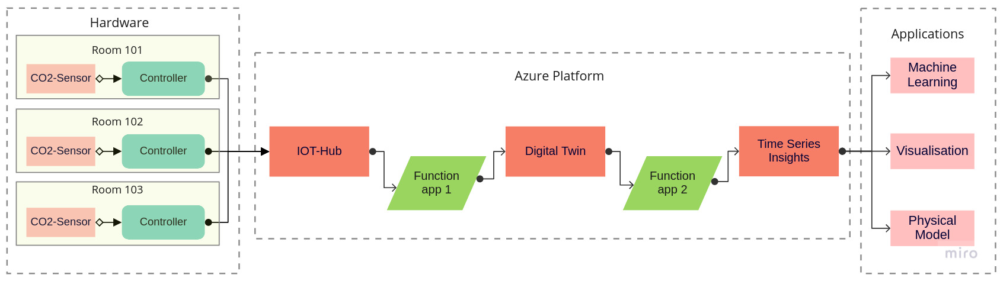

# Digital Twin Airquality For Covid Risk Assessment

## Contents

- 1 Introduction 
   - 1.1 Project Road Map
   - 1.2 Raspberry Pi
   - 1.3 Using Raspberry pi on our project
- 2 Setup: Microsoft Azure
   - 2.1 Create Account
   - 2.2 Install Azure CLI on your PC
   - 2.3 IoT Hub App
      - 2.3.1 Creating the hub app
      - 2.3.2 Usage and further info
   - 2.4 Create Digital Twins Platform
      - 2.4.1 Digital Twin Explorer
      - 2.4.2 To connect DT explorer to your Azure DT:
      - 2.4.3 Creating and uploading the model
   - 2.5 Local development with Azure
      - 2.5.1 Azure in Visual Studio
      - 2.5.2 Visual Studio Code Azure Extension
   - 2.6 Azure library for Python on Raspberry Pi
   - 2.7 Setup Debug Environment for Azure Functions in Visual Studio
   - 2.8 Physical Model
   - 2.9 Machine Learning
   - 2.10 Visualisation

# Introduction
 

--------------------------------------

The Digital Twin Airquality For Covid Risk Assessment is the Digital Twin project managed by Christian Doppler Laboratory for Model-Integrated Smart Production in Johannes Keppler University Linz, Austria.

For Contact:
Email: cdl-mint@se.jku.at

# Digital Twins
A  Digital  Twin  (DT)  is  often  referred  to  as  a  virtual  rep-resentation of a physical system, that enables a bi-directionalconnection  between  the  system  and  this  DT.  Integratingthis  Digital  Twin  with  a  physical  system  leverages  manyapplications,  such  as  real-time  monitoring,  virtual  testing,  orpredictive maintenance. 

(i) Implementation of the physical system withdedicated  hardware  tools

(ii) Simulation  script  to  mockthis physical system

(iii) Implementation of Digital Twins for this system using the tools provided by Microsoft Azure

(iv) Mobile  app  to  visualize  current  

(v) Physical  model of  the  system,  and

(vi) Machine  learning  approach  to  predictfuture air quality values.

 A detailed overview of the individualimplementation  parts  of  this  use  case  is  given  in each section.

 ## Hardware setup
In this section we will discuss about how our project is planned, its working architecture and data flow. Here you can find the detailed setup guide using Raspberry.

 
First a ”Data Receiving point” IOT hub will be created, then a Digital Twins platform will
be created were data flows through it for sake of visualising the entire sensor archetechture. A
related documentation is part of the linked [Quickstart](https://docs.microsoft.com/en-us/azure/digital-twins/quickstart-adt-explorer).

                                                          
