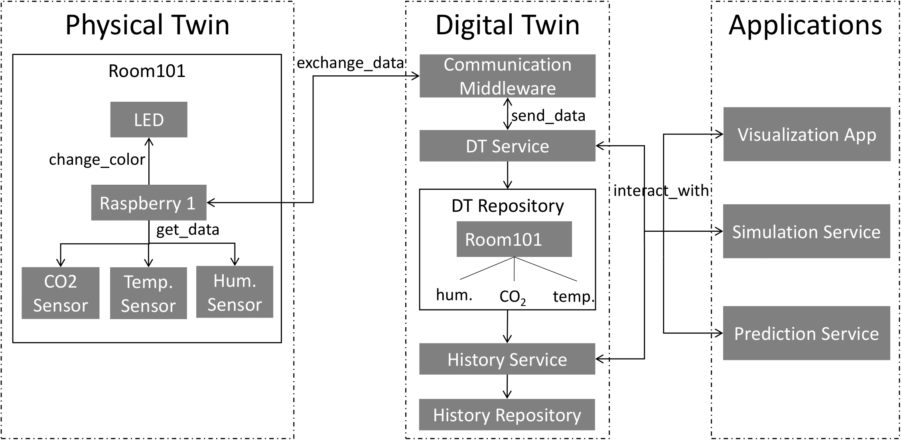

# An Exemplar for Model-Driven Digital Twin Development

This repository provides all source code + documentation for setting up an air quality use case, together with the respective Digital Twins to collect air quality data and applications that make use of these DTs.
                       
## Use Case Description
As the air quality within a room is correlation with concentration levels of office workers or the spread of viruses, it is interesting for organizations of different kinds to manage this air quality within their buildings, to ensure safety and production of employees, customers, or students. Therefore, air quality can be measured using metrics such as CO2 concentration, humidity or temperature values. If these values exceed certain threshold values, this bad level of air quality might have a negative impact of people within a room. Identifying such threshold violations and deriving appropriate measures can be used to ensure a certain air quality within the rooms of a building.
                       
## Digital Twin Exemplar
To implement the use case described above, we develop a Digital Twin of a Room. This Digital Twin consists of the current structure (e.g. which rooms are available, and what is the current air quality in these rooms) of the system stored in the DT Repository, and historical data stored in the History Repository.

To measure data from the actual room (i.e. the physical twin), we use a Controller that is connected to several sensors. The controller is also connected to some kind of alarm (e.g. a LED) to interact with the room (e.g. indicate that air quality is bad). This structure of the physical twin is also reflected in the Digital Twin.
                       
Besides this Physical and Digital Twin part, that interact with the Digital Twin (i.e. to get information about the current system structure and historical data, as well as indicate problems with air quality, or store predicted/experimental air quality data).

                       
## Contents of this Exemplar Repository
1. Implementation of Physical Twin: To set up the hardware required to implement the physical twin of the room, we provide a detailed description of used hardware, setup procedures, and automation scripts in [this folder](./physical_twin/hardware_setup). For testing purposes, we also provide a simulations scripts that mocks the hardware using random values for different air quality measures in [this folder](./physical_twin/simulated_hardware).
2. Implementation of Digital Twin: As an industry-scale implementation of Digital Twins and required infrastructure to run them, we provide documentation and code for setting up the DTs for the provided physical twins using existing PaaS-tools provided by Microsoft Azure in [this folder](./digital_twin/azure). We also provide two open-source alternatives for this Azure implementation in [this folder](./digital_twin/open-source). As a basis for discussion of the Model-Driven Development of Digital Twins for this Exemplar, we also provide UML and AutomationML models for different Evolution Scenarios in [this folder](./digital_twin/models).
3. Applications: As applications that make use of the implemented DT, we provide a [mobile app for visualization](./applications/visualisation), a [physical simulation model](./applications/physical_modelling), and a [prediction service](./applications/machine_learning). 
