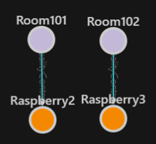
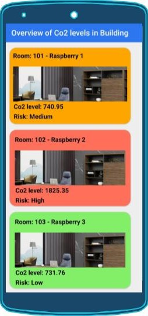
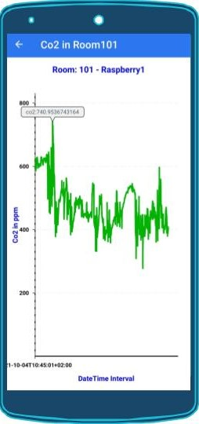
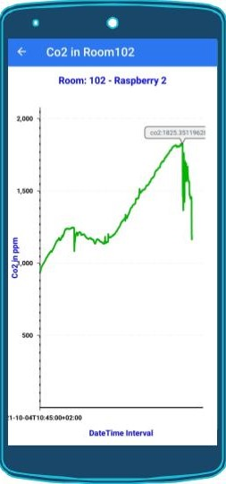
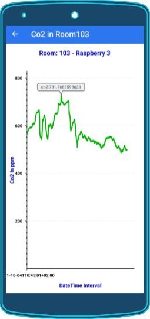

## Visualization of Co2 values in a Mobile App

### Contents

1.Introduction

2.Prerequisites

​	- 2.1 Raspberry Pi and Azure Setup

3.Visualization Needs

​	- 3.1 Azure Visualization Tools

​	- 3.2 Existing Visualization Capabilities in the Azure Platform

​	- 3.3 Extending Existing Capabilities

4.Mobile App

​	- 4.1 Prerequisites

​	- 4.2 Run the App

### **1. Introduction**

Measure the air quality in indoor environment by using the CCS811 sensor in rooms. The overview of the sensor data in each rooms can be visualized in a mobile app. The sensor data from rooms is collected in a [csv file](https://github.com/derlehner/IndoorAirQuality_DigitalTwin_Exemplar/tree/main/applications/visualisation/dataSet2.csv),parsed into required json format using the [python script](https://github.com/derlehner/IndoorAirQuality_DigitalTwin_Exemplar/tree/main/applications/visualisation/csvReaderJsonWriter.py) and used as the dataset for visualization. 

### 2. Prerequisites:

#### 2.1 Raspberry Pi and Azure Setup

Set up the hardware Raspberry pi with Co2 sensor- CCS811 for different rooms as described in the section [physical twin](https://github.com/derlehner/IndoorAirQuality_DigitalTwin_Exemplar/tree/main/physical_twin/hardware_setup) and send co2 values to Azure as described in the section [simulated hardware](https://github.com/derlehner/IndoorAirQuality_DigitalTwin_Exemplar/tree/main/physical_twin/simulated_hardware)

### **3. Visualization needs**

Based on our use case, we envision the following visualization needs:

(1) Visualization of raw Co2 values to indicate threshold violations and take immediate actions for people located in rooms. 

(2) Administrative staff is rather interested in an overview of current Co2 values and threshold violations. Also, comparisons between different environments might be interesting.

 (3) Development of Co2-values over time can give insights into trends and show results of certain actions. 

(4) To get full overview of the running system and cut down cost incurred by maintaining different tools, the visualizations needed to satisfy visualization needs (1),(2) and (3) should be combined into one single solution. 

(5) To monitor a building and take actions even from a remote location, there is the need to access existing visualizations using e.g. a mobile device.

#### **3.1 Azure Visualization Tools**

Microsoft Azure provides the following tools for visualization

​	1. Digital Twin Explorer

​	2. Time Series Explorer

#### 3.2 Existing Visualization Capabilities in the Azure Platform

The  Azure platform provides out of the box visualization capabilities. To some extent, the following tools can be used to achieve the visualization goals mentioned above.

**Prerequisites:**

set up the Azure DT and TSI explorer as described in [Azure section](https://github.com/derlehner/IndoorAirQuality_DigitalTwin_Exemplar/tree/main/digital_twin/azure)

**Azure Digital Twins Explorer**

It is used for visualizing of the current system snapshot during runtime, which is represented by the DT. Visualization capabilities include a graph view of DTs and their relationships to each other, as well as a detailed view of current property values of a DT.  Users can view, query, and edit the models, twins, and relationships according to specific user needs. 

In our sample project, the DT is created with [twin models](https://github.com/derlehner/IndoorAirQuality_DigitalTwin_Exemplar/tree/main/digital_twin/azure/create_twins/twin_models)  and the output of DT explorer is shown below. The DT explorer has the digital twin of Raspberry 1,2 and Room101 and 102, the Rooms and Raspberry are connected with relationship airQualityControllers as described in [Room101.json](https://github.com/derlehner/IndoorAirQuality_DigitalTwin_Exemplar/blob/main/digital_twin/azure/create_twins/twin_models/Room101.json)



This satisfies visualization need (1) and also partly satisfies visualization need (2) as it lacks the capabilities to directly compare Co2 values from different rooms.

**Azure Time Series Explorer**

It is used to visualize historical values measured by a DT. Data visualization can be customized by 

(i)Using different chart types such as Line, Heatmap, Scatter plots

(ii)Filtering displayed data with user-defined queries.

(iii)Monitor data from different environments and sensors, analyse data patterns and also statistics.

The TSI explorer displays the historical sensor data as shown below. The x-axis denotes the datetime interval and the y-axis denotes the co2 values in parts per million(ppm).


Therefore, this tool can be used to satisfy visualization need (3).

#### **3.3 Extending Existing Capabilities**

Although existing tools provided by Azure satisfy some of the visualization needs for our use case (i.e. visualization need 1 and 3, and visualization need 2 in part), some visualization needs are still not covered. Visualization need 4 is not satisfied as Azure offers dedicated tools for serving different visualization needs, but does not allow to combine these tools into a single system for visualization. Although Azure already provides a mobile App for their services, this app does not allow access to existing visualization tools. Therefore, visualization need 5 is not satisfied.
To overcome these limitations, we propose a mobile app solution for custom visualization and also to take immediate actions even from remote locations.

However, to enable real-time data visualization in a mobile app, this app requires access to the information provided by the DT in Azure. Therefore, both the ADT and TSI service provide dedicated RESTful APIs. 

**Azure Digital Twin REST API**

https://docs.microsoft.com/en-us/rest/api/azure-digitaltwins/

enables to query data about DTs stored in ADT.

 **Azure Time Series Insights Query API**

https://docs.microsoft.com/en-us/rest/api/azure-digitaltwins/

allows to query historical data of DTs  with custom search span and filter options.

### **4. Mobile App**

To fulfil visualization need 2,4 and 5 completely, we have developed a mobile app solution with following features.

We have used **React-Native framework** for cross-platform mobile app development and you can find the source code for the app here [App](https://github.com/derlehner/IndoorAirQuality_DigitalTwin_Exemplar/tree/main/applications/visualisation/App)

#### Prerequisites:

Set up the React Native development environment by following the instructions from [environment setup](https://reactnative.dev/docs/environment-setup). We have used the following operating systems and ide tools for app development. 

Development OS-Windows

Target OS- Android

React Native Code Editor- Visual Studio Code

**Installing dependencies:**

Node,JDK,Android Studio,Android SDK

Physical mobile device 

**Run the App in Android Mobile:**

1. To run the app in an android mobile device, plug an USB cable to connect your android mobile to the system and enable developer options in your phone by following the instructions [ run in device](https://reactnative.dev/docs/running-on-device).

2. Clone and navigate to the project folder from command line.

3. Run the command from command line to view the app

   ```
   npx react-native run-android
   ```

**Mobile App Screenshot**

**1.Overview of Co2 levels in Building:**

The initial screen of the app displays overview of current Co2 levels in different rooms with risk level indicators. The color  are used to indicate the risk level in each of the rooms. (Red-High, Orange-Medium and Green-Low).



**2. Chart View**

By clicking on the room image from screen1 , you will be navigated to the sensor data of that room(in our sample, it is Lobby 100 and data is from Raspberry1). 

**Datasets**

The detailed description about the datasets can be viewed from the section [simulated hardware](https://github.com/derlehner/IndoorAirQuality_DigitalTwin_Exemplar/tree/main/physical_twin/simulated_hardware). we have used one of the dataSets(dataSet2.csv) and description is as follows:

[1.dataSet2.csv](https://github.com/derlehner/IndoorAirQuality_DigitalTwin_Exemplar/tree/main/applications/visualisation)

We have obtained the real-time sensor data with SCD-30 sensors setup in three rooms and data collection was made during the day time when people are working. The data collection set up is as follows :

| Dataset      | Room                    | Sensor_Type | No_of_Sensors | Time_Span |
| ------------ | ----------------------- | ----------- | ------------- | --------- |
| dataSet2.csv | Room101,Room102,Room103 | SCD-30      | 3             | 5 hours   |

**Dataset description:**

**a) dataSet2**

**1. Room 101**

The dataSet2 from Room 101 was collected when there were maximum of two people working in room for most of the time and three more people were also present in room for few minutes. The window was opened in the room for every one hour. The maximum co2 value in Room 101 is **740.95** as shown below in screenshot. since the window was opened for every one hour, the co2 level is under control with low risk.




**2. Room 102**

The dataSet2 from Room 102 was collected when there were maximum of two people working in room for most of the time and two more people were also present in room for few minutes. The windows were closed in the room. The maximum co2 value in Room 102 is **1825.35** as shown below in screenshot. since the window was not opened, the co2 level is very high compared to the  other rooms(Room101 , Room103) and risk is also high .



**3. Room 103**

The dataSet2 from Room 103 was collected when there was only one person working in room. The window was opened in the room for about three hours. The maximum co2 value in Room 103 is **731.76** as shown below in screenshot. since the window was  opened and only one person is in the room, the co2 level is very low compared to the  other rooms(Room101 , Room102) and risk is very low .




Generally, the co2 level in indoor environment should not exceed 1000 ppm. The sensor data from the datasets  [dataSet2.csv](https://github.com/derlehner/IndoorAirQuality_DigitalTwin_Exemplar/tree/main/applications/visualisation) is parsed to get co2 measurements. The  measurements are then sent to Azure IoT devices. you can use the existing csv file for sample sensor data or replace with your own csv file with actual or mock up sensor values.

**Line Chart**

The line chart  displays the co2 values obtained from three SCD-30 sensors setup in Room101, Room102 and Room103 respectively.

**Axis**

The x- axis displays the datetime interval in year month date hour minutes and seconds format(yyyy-mm-dd hh:mm:ss).

The y-axis displays the Co2 in ppm.

 **Application of MDE techniques**

In the proposed mobile app, we need to specify the information about rooms (e.g. identifier of room and building, available sensors, available data of these sensors). However, this information is already provided in the DT. By creating a Meta-Model for the visualizations, and transforming the DT model to this visualization model, we could automatically configure existing visualizations using the information from the DT. By creating pre-defined configuration of visualizations (by e.g. specifying plot types or filters), we can also automatically generate visualizations for a newly created DT.


