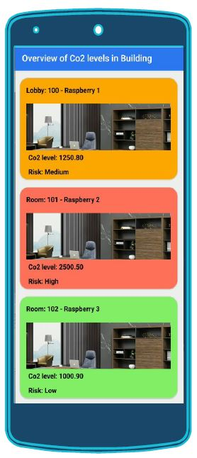

## Visualization of Co2 values in a Mobile App

### Table of Contents

1.Introduction

2.Rasperry Pi and Azure Setup

3.Visualization Needs

​	-3.1 Azure Visualization Tools

​	-3.2 Existing Visualization Capabilities in the Azure Platform

​	-3.3 Extending Existing Capabilities

4.Mobile App

### **1. Introduction**

Predict the COVID19 risk infection in indoor environment by measuring the Co2 value from rooms. Increased levels of Co2 in rooms increases the probability of COVID-19 risk infection. So we need to monitor the Co2 and maintain certain level of air-quality inside rooms to prevent the risk infection . 

### **2. Raspberry Pi and Azure Setup** 

**Prerequisite:**

Set up the hardware Raspberry pi with Co2 sensor- CCS811 for different rooms as described in the section [physical twin](https://github.com/derlehner/DigitalTwin_Airquality_For_Covid_Risk_Assessment/tree/development/physical_twin/hardware_setup) and send co2 values to Azure as described in the section [simulated hardware](https://github.com/derlehner/DigitalTwin_Airquality_For_Covid_Risk_Assessment/tree/main/physical_twin/simulated_hardware)

### **3. Visualization needs**

Based on our use case, we envision the following visualization needs:

(1) Visualization of raw Co2 values to indicate threshold violations and take immediate actions for people located in rooms. 

(2) Administrative staff is rather interested in an overview of current Co2 values and threshold violations. Also, comparisons between different environments might be interesting.

 (3) Development of Co2-values over time can give insights into trends and show results of certain actions. 

(4) To get full overview of the running system and cut down cost incurred by maintaining different tools, the visualizations needed to satisfy visualization needs (1),(2) and (3) should be combined into one single solution. 

(5) To monitor a building and take actions even from a remote location, there is the need to access existing visualizations using e.g. a mobile device.

#### **3.1 Azure Visualization Tools**

Microsoft Azure provides the following tools for visualization

​	1. Digital Twin Explorer

​	2. Time Series Explorer

#### **3.2 Existing Visualization Capabilities in the Azure Platform:**

The  Azure platform provides out of the box visualization capabilities. To some extent, the following tools can be used to achieve the visualization goals mentioned above.

**Azure Digital Twins Explorer**

It is used for visualizing of the current system snapshot during runtime, which is represented by the DT. Visualization capabilities include a graph view of DTs and their relationships to each other, as well as a detailed view of current property values of a DT.  Users can view, query, and edit the models, twins, and relationships according to specific user needs.
This satisfies visualization need (1) and also partly satisfies visualization need (2) as it lacks the capabilities to directly compare Co2 values from different rooms.

**Azure Time Series Explorer**

It is used to visualize historical values measured by a DT. Data visualization can be customized by 

(i)Using different chart types such as Line, Heatmap, Scatter plots

(ii)Filtering displayed data with user-defined queries.

(iii)Monitor data from different environments and sensors, analyse data patterns and also statistics.

Therefore, this tool can be used to satisfy visualization need (3).

#### **3.3 Extending Existing Capabilities**

Although existing tools provided by Azure satisfy some of the visualization needs for our use case (i.e. visualization need 1 and 3, and visualization need 2 in part), some visualization needs are still not covered. Visualization need 4 is not satisfied as Azure offers dedicated tools for serving different visualization needs, but does not allow to combine these tools into a single system for visualization. Although Azure already provides a mobile App for their services, this app does not allow access to existing visualization tools. Therefore, visualization need 5 is not satisfied.
To overcome these limitations, we propose a mobile app solution for custom visualization and also to take immediate actions even from remote locations.

However, to enable real-time data visualization in a mobile app, this app requires access to the information provided by the DT in Azure. Therefore, both the ADT and TSI service provide dedicated RESTful APIs. 

**Azure Digital Twin REST API**

https://docs.microsoft.com/en-us/rest/api/azure-digitaltwins/

enables to query data about DTs stored in ADT.

 **Azure Time Series Insights Query API**

https://docs.microsoft.com/en-us/rest/api/azure-digitaltwins/

allows to query historical data of DTs  with custom search span and filter options.

### **4. Mobile App**

To fulfil visualization need 2,4 and 5 completely, we have developed a mobile app solution with following features.

We have used **React-Native framework** for cross-platform mobile app development and you can find the source code for the app here [App](https://github.com/derlehner/DigitalTwin_Airquality_For_Covid_Risk_Assessment/tree/development/applications/visualisation/App)

**Prerequisites:**

Set up the React Native development environment by following the instructions from [link](https://reactnative.dev/docs/environment-setup). We have used the following operating systems and ide tools for app development. 

Development OS-Windows

Target OS- Android

React Native Code Editor- Visual Studio Code

**Installing dependencies:**

Node,JDK,Android Studio,Android SDK

Physical mobile device 

**Run the App in Android Mobile:**

1. To run the app in an android mobile device, plug an usb cable to connect your android mobile to the system and enable developer options in your phone by following the instructions [here](https://reactnative.dev/docs/running-on-device).

2. Clone and navigate to the project folder from command line.

3. Run the command from command line to view the app

   ```
   npx react-native run-android
   ```

**Mobile App Screenshot**

An App with a overview of current Co2 levels in different rooms with risk level indicators. The color  are used to indicate the risk level in each of the rooms. (Red-High, Orange-Medium and Green-Low).



 **Application of MDE techniques**

In the proposed mobile app, we need to specify the information about rooms (e.g. identifier of room and building, available sensors, available data of these sensors). However, this information is already provided in the DT. By creating a Meta-Model for the visualizations, and transforming the DT model to this visualization model, we could automatically configure existing visualizations using the information from the DT. By creating pre-defined configuration of visualizations (by e.g. specifying plot types or filters), we can also automatically generate visualizations for a newly created DT.


