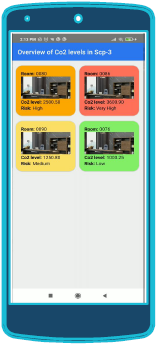

**Introduction**

Predict the COVID19 risk infection from indoor environment by measuring the correlated COVID-19 parameters responsible for spreading infection risk. In our case we are going to monitor the Co2 values over time with Co2 sensor CCS811 set up in different rooms of the building.

For our use case, we envision the following **visualization needs**: 

(1) Visualization of raw Co2 values to indicate threshold violations and take immediate actions for people located in rooms. 

(2) Administrative staff is rather interested in an overview of current Co2 values and threshold violations. Also, comparisons between different environments might be interesting.

 (3) Development of Co2-values over time can give insights into trends and show results of certain actions. 

(4) To get full overview of the running system and cut down cost incurred by maintaining different tools, the visualizations needed to satisfy visualization needs (1),(2) and (3) should be combined into one single solution. 

(5) To monitor a building and take actions even from a remote location, there is the need to access existing visualizations using e.g. a mobile device.

**Visualization Tools:**

Industrial Use case:

1. Microsoft Azure

​	-Digital Twin Explorer

​	-Time Series Explorer

**Existing Visualization Capabilities in the Azure Platform:**

The  Azure platform provides out of the box visualization capabilities. To some extent, the following tools can be used to achieve the visualization goals mentioned above.

**Azure Digital Twins Explorer**

It is used for visualizing of the current system snapshot during runtime, which is represented by the DT. Visualization capabilities include a graph view of DTs and their relationships to each other, as well as a detailed view of current Property values of a DT. %A user can view, query, and edit the models, twins, and relationships according to specific user needs.
This satisfies visualization need (1) and also partly satisfies visualization need (2) as it lacks the capabilities to directly compare Co2 values from different rooms.

**Azure Time Series Explorer**

It is used to visualize historical values measured by a DT. Data visualization can be customized by $(i)$~using different chart types such as Line, Heatmap, Scatter plots, and $(ii)$~filtering displayed data with user-defined queries.
Therefore, this tool can be used to satisfy visualization need (3).

**Extending existing Capabilities**

Although existing tools provided by Azure satisfy some of the visualization needs for our use case (i.e. visualization need 1 and 3, and visualization need 2 in part), some visualization needs are still not covered. Visualization need 4 is not satisfied as Azure offers dedicated tools for serving different visualization needs, but does not allow to combine these tools into a single system for visualization. Although Azure already provides a mobile App for their services, this app does not allow access to existing visualization tools. Therefore, visualization need 5 is not satisfied.
To overcome these limitations, we propose a mobile app solution for custom visualization and also to take immediate actions even from remote locations.

However, to enable real-time data visualization in a mobile app, this app requires access to the information provided by the DT in Azure. Therefore, both the ADT and TSI service provide dedicated RESTful APIs. The Azure Digital Twin REST API

https://docs.microsoft.com/en-us/rest/api/azure-digitaltwins/enables to query data about DTs stored in ADT. The Azure Time Series Insights Query API

https://docs.microsoft.com/en-us/rest/api/azure-digitaltwins/

allows to query historical data of DTs.

**Application of MDE techniques**

In the proposed mobile app, we need to specify the information about rooms (e.g. identifier of room and building, available sensors, available data of these sensors). However, this information is already provided in the DT. By creating a Meta-Model for the visualizations, and transforming the DT model to this visualization model, we could automatically configure existing visualizations using the information from the DT. By creating pre-defined configuration of visualizations (by e.g. specifying plot types or filters), we can also automatically generate visualizations for a newly created DT.

