# Implementation of Digital Twins with Azure tools

## Contents
- 1 Digital Twins on Azure Environment
   - 1.1 Setting up azure
   - 1.2 Setup IoT-Hub
   - 1.3 Setup Azure Digital Twins Service (ADT)
   - 1.4 Setup Time Series Insights Service (TSI)
   - [1.5 Setup Function App 1: ExtractDeviceData](#1-5-functions-app-1)
   - 1.6 Setup Function App 2: TransformTwinData
   - 1.7 Connect ExtractDeviceData to IoT-Hub and ADT
   - 1.8 Setup Time Series Insights Service (TSI)
   - 1.9 Setup Azure Function 2: TransformTwinData
   - 1.10 Connect TransformTwinData to ADT and TSI
- 2 Implementation of Use Case
   - 2.1 Specify Digital Twins
   - 2.2 Create Digital Twins in ADT and TSI
   - 2.3 Create Device Endpoints in IoT-Hub

## Digital Twins on Azure Environment
 [Microsoft Azure](https://azure.microsoft.com/en-gb/) is a cloud solution which provides services like [Internet-Of-Things](https://www.wikiwand.com/en/Internet_of_things) and other [Industries 4.0 services](https://www.wikiwand.com/en/Fourth_Industrial_Revolution) with a lot of resources and services.  
 The once that are interesting for this project and are covered by this documentation like [IoT-Hub](https://azure.microsoft.com/en-us/services/iot-hub/), [Digital Twins](https://azure.microsoft.com/en-us/services/digital-twins/), [Time Series Insights](https://azure.microsoft.com/en-us/services/time-series-insights/). Also we explained how we can get adavantages out of these services and integrate our project as one of_"STATE OF THE ART"_  idea that everyone can implement without any struggles.
### 1.1 Setting up azure

#### 1.1.1 Create Azure Account
  

It is possible to get a free Microsoft Azure account, but it is recommended to create a Microsoft Azure student account, because it will apply $100 credit to the account. To create a Microsoft Azure student account it is necessary to have two different e-mail addresses which is the academic e-mail address (@jku.at) to verify you are eligible or the student account, another e-mail address, that will be used as login and main e-mail
address for Azure. Follow the process:

1. Go to this link and click _[”free account”](https://azure.microsoft.com/en-us/free/students/)_ on top right.
2. On next page click _”start free”_
3. Enter your data and your account will be created.

The actual work path will be explained in this image to get better understanding: For the **Hardware Setup** its been explained in [this sections](https://github.com/derlehner/DigitalTwin_Airquality_For_Covid_Risk_Assessment/tree/main/physical_twin/hardware_setup) under `/physical_twin/hardware_setup`

 

### 1.2 Setup IoT-Hub

[**IoT Hub**](https://docs.microsoft.com/en-us/azure/iot-hub/) is a `Platform-as-a-Services (PaaS)` managed service, hosted in the cloud, that acts as a central message hub for bi-directional communication between an IoT application and the devices it manages. This is one of the services which Azure enables highly secure and reliable communication between your `Internet of Things (IoT)` application and the devices it manages. 


Azure IoT Hub provides a cloud-hosted solution back end to connect virtually any device. IoT Hub is the entry point to the data which we actually want to work on after receiving here we have huge options to work on with. We can use the IoT app as a source for other azure services. In this section an Azure IoT hub will be created. A related documentation is part of the [linked Quickstart](https://docs.microsoft.com/en-us/azure/iot-hub/quickstart-send-telemetry-pythoncreate-an-iot-hub). 
The main Usage this service is:

- Manage IoT Devices (make successful connections for data transfer)
- You can send Telemetry-data securely from physical hardware (sensor)
    to Azure. For info [refer this website](https://docs.microsoft.com/en-us/azure/iot-hub/quickstart-send-telemetry-python)
- Using ‘Message Routing’ option telemetry messages can be sent to : Events,
    Storage, Event Hubs and much more.

Steps to create IoT-Hub:
1. In the azure resources search for IoT Hub

 

2. click create
3. Using this required data create the azure app. The required data:
- Resource group
- Resource Locationd
- IOT hub Name

 

4. You will be created the azure IoT-Hub app now.

#### 1.2.1 IoT-Devices
IoT-Devices are digital devices which is same as we have in our physical world _sensor with raspberry_ in our example. We have phycial devices in each room, by using `IoT Device` we are defining in azure that this is a device and by that we can use it to transfer the data to azure from the physical device.

1. In the IoT-Hub app go to the IoT devices section from the left side, then you will
    able to view all the available devices if there are already any stored.

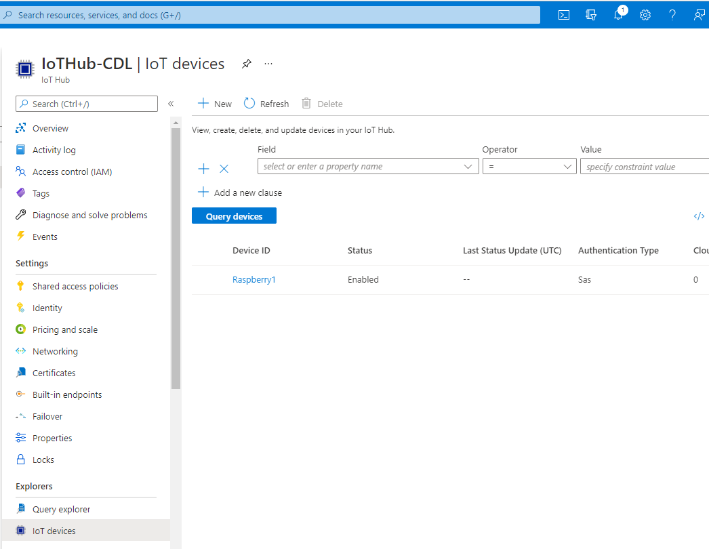 

2. Click ”new” button on top and enter the preferred name for a device and
    then save it.

 

4. Now you have been created new device now. If you click any one of available device you can view its properties like `device ID` ,`Primary Key`, `connection string` and so on... 

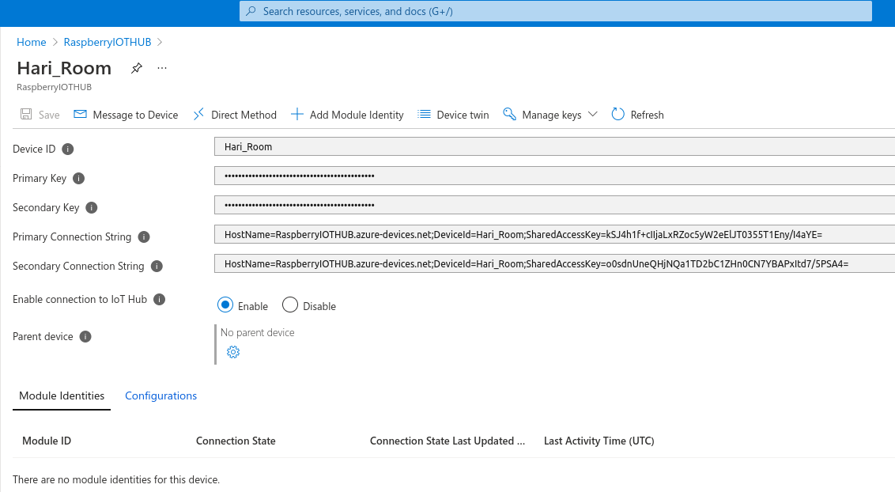 


### 1.3 Setup Azure Digital Twins Service (ADT)

Azure Digital Twins is an Internet of Things (IoT) platform that enables you
to create a digital representation of real-world things, places, and business pro-
cesses. 
In this section a Digital Twins platform will be created. A related doc-
umentation is part of the [linked Quickstart](https://docs.microsoft.com/en-us/azure/digital-twins/quickstart-adt-explorer).
Please follow the process on the azure portal:
1. Search for”Azure Digital Twin” in [azure resource](https://portal.azure.com)

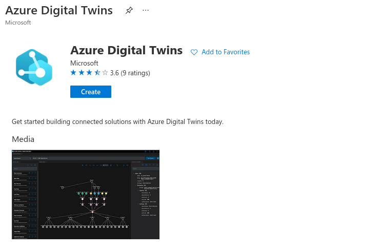 

2. You will need to press the Button "create" at the Azure Digital Twins page.

3. At the next page you will have to add
    - a resource group,
    - location and
    - a name for the Digital Twins service.

 


In the above image you can find the home page of the Digital twin of azure here in the _Essentials_ part you can find the detials and there will be `Host Name` on the right side in our case:

```sh
Host name  :  Covid-Risk-Accessment-DigitalTwin.api.weu.digitaltwins.azure.net
```

This ”Host Name”where you can find in DT homepage is the string should be noted. It is used further for installing ADT Explorer.


#### 1.3.1 Setup Digital Twin Explorer

Digital Twin Exploreris the easy way to visualise our model architecture, import,
export our models. This should be installed in our pc. Requirements for DT
Explorer: Node.js (not less then version 10), npm. The process to install DT
Explorer:

1. Installing node.js on ubuntu by command line: 
```
sudo apt install curl
curl sL https://deb.nodesource.com/setup10.x — sudo E bash
sudo apt install node js 
```
2. Download and extract the Digital Twin Explorer files. Download and extract the Digital Twin Explorer files [from this repo](https://github.com/Harighs/Azure-Digital-Twin-Explorer-Installation)
3. Run terminal under this directory: `digital-twins-explorer-main/client/src`
4. Run the command: to install the npm 
```sh
npm install 
```
5. Run this below command: to start the `DT Explorer`. you will be launched locla host website from your brwoser opening the `Azure Digital Twin Explorer`
```sh
npm run start
```
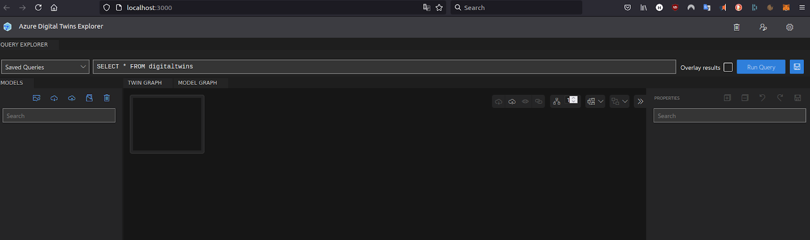 


1.3.2 To connect DT explorer to your Azure DT:

1. Copy host name from your Digital twin home page, and add‘https://’ in front
for example: https://DigitalTwin-DigitalTwinApp.api.weu.digitaltwins.azure.net
2. Then click login icon on top right on DT explorer you already opened Paste
the string here and click ok. You will be now connected to the azure

1.3.3 Creating and uploading the model

1. All DT models should be written in `.json` file
2. Open your favourite code editor and create new .json file. in below image you can find sample code.

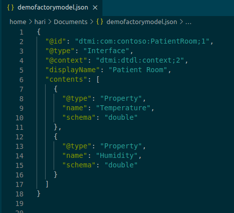 

3. This code above is the example simple model which contains ‘temperature’ and ‘Humidity’.It is based on azure DTDL language. [More about it](https://docs.microsoft.com/en-us/azure/digital-twins/concepts-models) 
4. For uploading, click the upload button on DT explorer and select the .json file you created before. Then your model will be shown below.

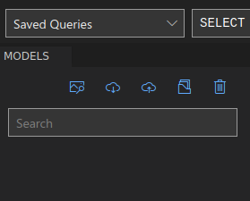 

5. Then finally the model is created and will be visualized if added to the explorer. an example is shown here.

 

### 1.4 Setup Time Series Insights Service (TSI)

we need to visualize the data from our event source to TSI. The event source could either be Event Hub or IoT Hub. In our case, we have chosen event source as the Event Hub to transfer the DT data. 

we can create the new time series resource in Azure by following the steps below.

1. Search for time series resource from Azure explorer and create new time series resource.

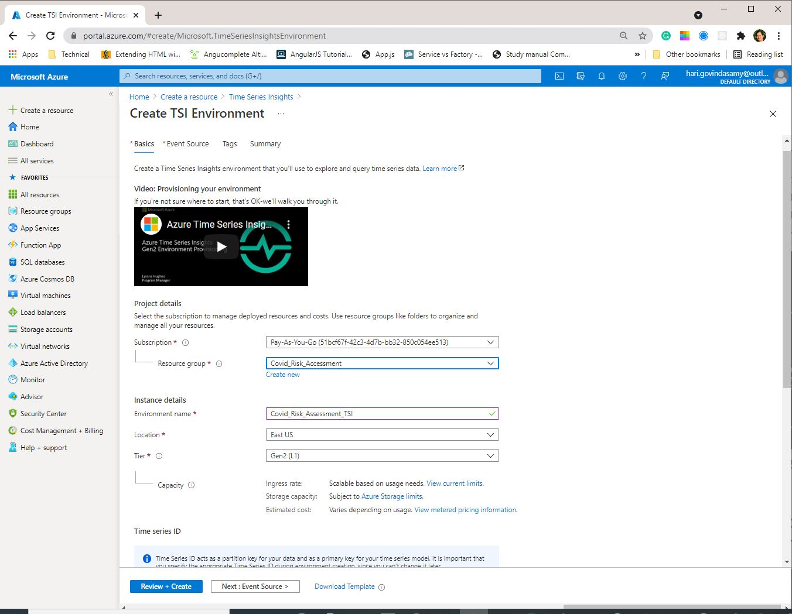

2. Setup the event source as Event Hub in the next section as shown below. choose your event hub which you have already created inside your event hub namespace.

   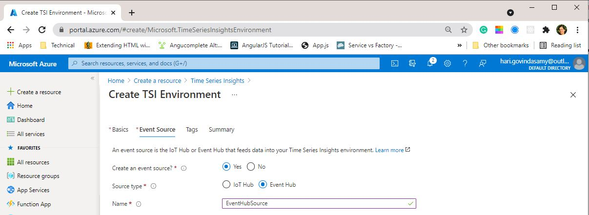

   3. After successful creation of time series instance, you can view them in the Azure Time Series Insights Environment.

   

   4. To view the time series graph, click on go to TSI Explorer button as shown below.

   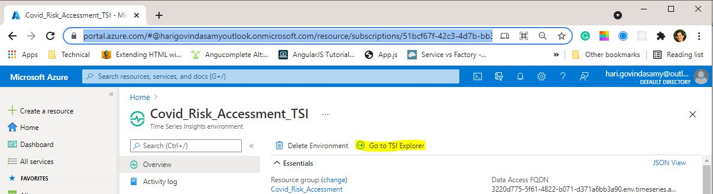

   we can view the data in the TSI Explorer as shown below.

   The time series explorer has the graph and model menu for displaying graph and setting model instances and hierarchies.

   From model menu, choose the time series instance and the variable that need to be displayed in the graph. 

   for instance , we have the co2 data in property co2 , select variable and add them into graph.

   similarly, we can customise the graph with other chart types such as Heat map or scatter plot and can view specific data by choosing desired time intervals and applying filters on the data.

   

   

   

### <a name="1-5-functions-app-1"></a> 1.5 Setup Function App 1: ExtractDeviceData

We are setting up this Azure function for transferring the device data from IoT Hub to DT. This function is triggered by Event Grid Trigger  and when the IoT device receives data it sends this to the DT internally.

**Creating Azure Function**

1. a) Create a new C# project and choose Azure Function as Project template


   b) Choose the Event Hub trigger that runs whenever event is fired in Azure Digital Twin


**Packages required:**

Add the following NuGet packages to the project to interact with Azure Digital Twin

1. Azure.DigitalTwins.Core

2. Azure.Identity

3. System.Net.Http

4. Azure.Core

   replace the function.cs file with the [project code](https://github.com/derlehner/DigitalTwin_Airquality_For_Covid_Risk_Assessment/blob/main/digital_twin/AzureFunctionApp1/Function1.cs)

   In this function, we have created the environment variable  accessing the Digital twin instance. Once the IoT device receives the data, the event grid triggers the azure function and we do some pre-processing steps like the JSON serialization for converting the telemetry data into the required data format. Finally we use AddReplace method to update the twin with new data.

   Publish the app to Azure with a function name , resource group.


   **Verify if publish is successful in Azure:**

   search for the function name in azure and if it appears, the publish is successful.

   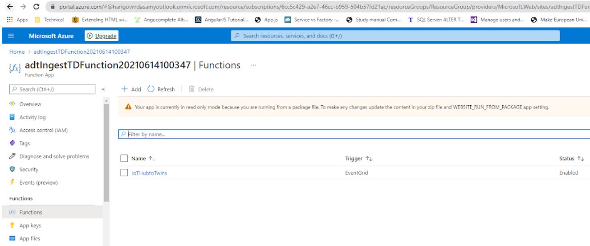

   

**Set Environment Variable for published azure function:**

We have created the environment variable in the Azure function, now we need to set up the DT url for the created environment variable in Azure , so that we can access the published azure function and get the data for further processing.

Go to published function app in azure → configuration → new application settings.

Put the **name** similar to environmental variable created for function app in C# and **value** as host name of Azure Digital Twin and save configuration settings.

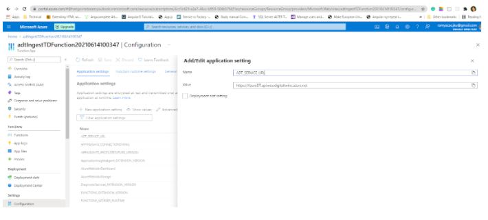

Now we have successfully set up the security access for function app. Environment variable is created as follows


**Connect the function app to IoT Hub**

Set up IoT Hub to send device telemetry messages to function App as **Events**.

Go to IoT Hub → Events → Event Subscription.

Create new Event Subscription in IoT Hub.

Choose Device Telemetry Event type and Select the end point type as Azure function. Select the published function App and function name from drop down menu as shown below.

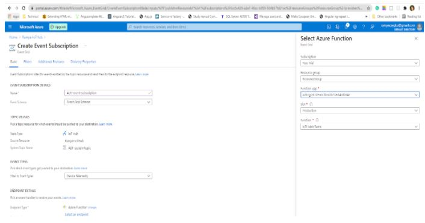

***Possible Errors:** Event Grid is not registered by default. Register Event Grid if it is not present in the subscriptions with the following steps

Subscriptions → choose your subscription→ search event grid and add it.

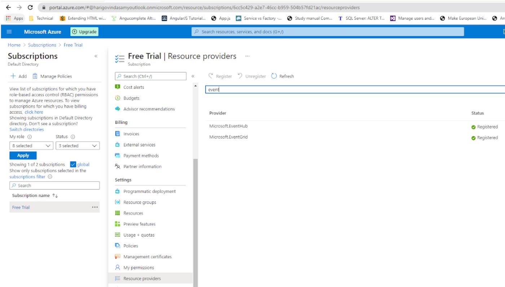

Now the event subscription is created . When data is sent to IoT Hub , events are registered and event subscription will receive the events from IoT Hub as shown below.

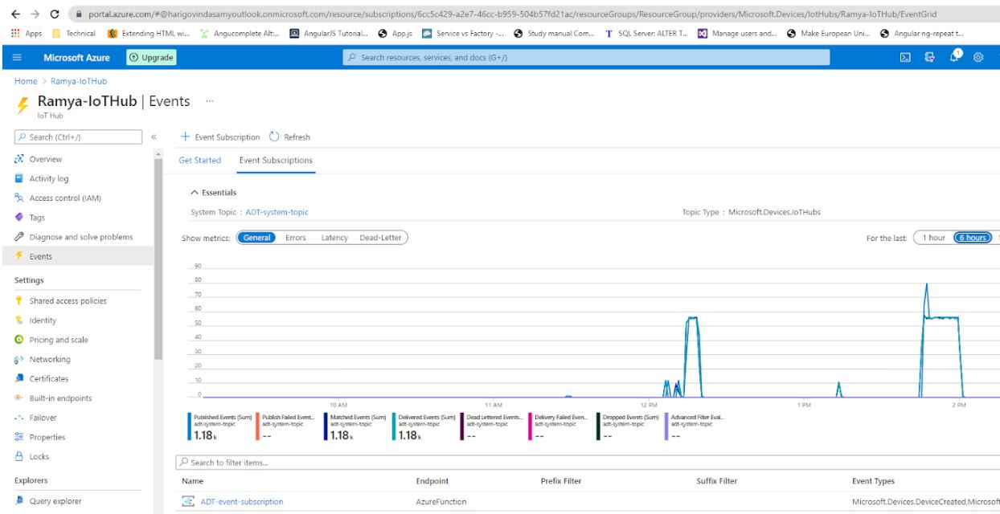

Now if the IoT device receives data,event grid is triggered and data is sent to DT azure function. The DT function receives data and appears as follows.

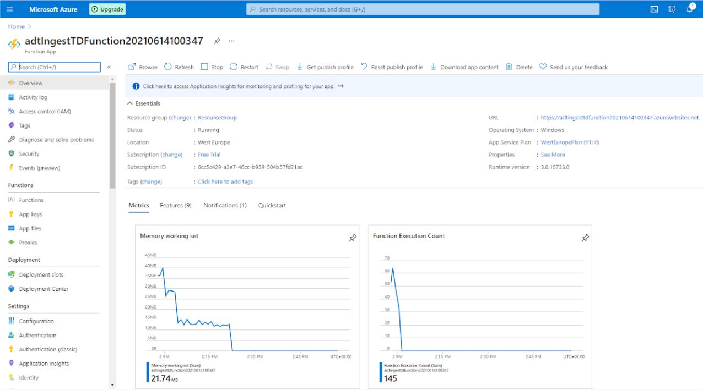

#### **Allow functions-app to access Azure Digital Twins**

As the function-app uses the [`ManagedIdentityCredential`](https://docs.microsoft.com/en-us/dotnet/api/azure.identity.managedidentitycredential?view=azure-dotnet) to connect to the Azure Digital Twins platform, it needs to have extended privileges. To configure these privileges, first the Azure Function App needs to have system-assigned identity enabled. To do so open up your Function App in the Azure Portal and navigate to `Settings > Identity` and turn the status of `System assigned` to `On`.

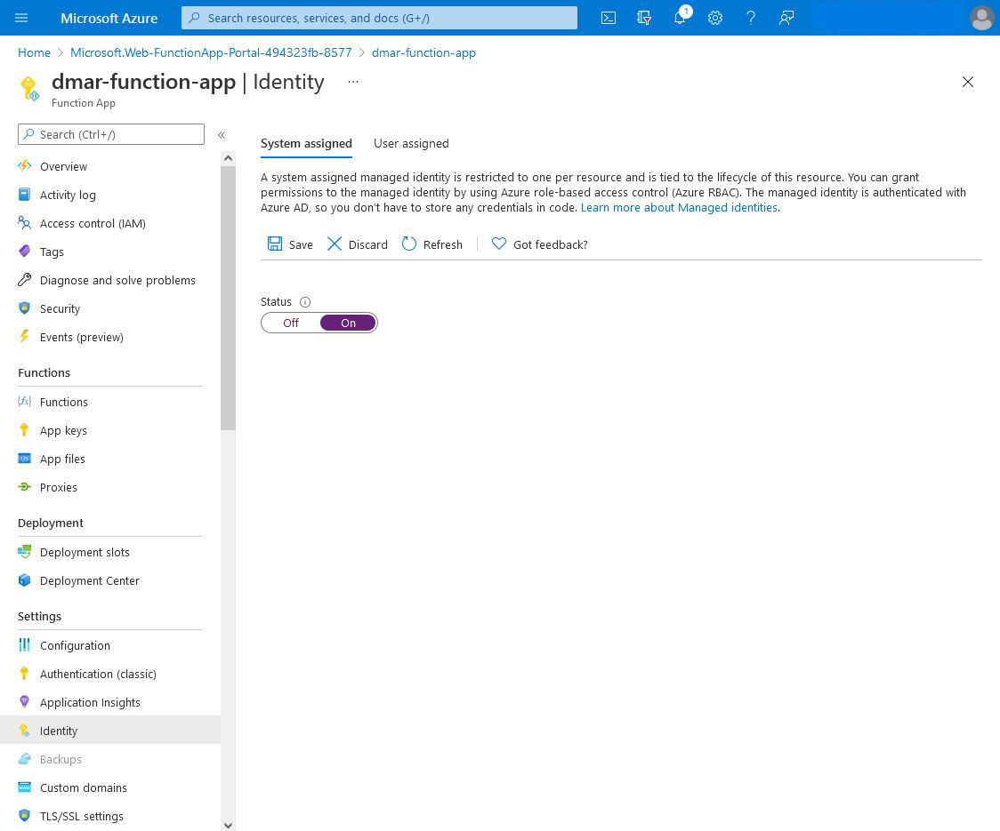

After enabling the system-assigned identity, you need to assign the "Azure Digital Twins Data Owner" role to the Function App. Navigate to your Azure Digital Twins instance in the Azure Portal and select `Access control (IAM)`. Click `Add > Add role assignment` next. Select role `Azure Digital Twins Data Owner` and `Assign access to` "Function App", finally select the corresponding `Subscription` and pick the correct function.


Alternatively you can also use the Azure-Powershell to do so. More detailed instructions can be found [here](https://docs.microsoft.com/en-us/azure/digital-twins/how-to-authenticate-client#assign-an-access-role)

### 1.6 Setup Function App 2: TransformTwinData

Now we need to create Azure function to transform the twin data to the TSI instance. we have used C# to create Azure function as it provides ready-to-use project template for event hub triggers. 

1. Create Azure Function with Event Hub Trigger

   a) Create a new C# project and choose Azure Function as Project template


   b) Choose the Event Hub trigger that runs whenever event is fired in Azure Digital Twin


Navigate to the project folder [AirQualityUseCase](https://github.com/derlehner/DigitalTwin_Airquality_For_Covid_Risk_Assessment/tree/main/digital_twin/AirQualityUseCase) and file

[ProcessDTTelemetryUpdateTSI.cs](https://github.com/derlehner/DigitalTwin_Airquality_For_Covid_Risk_Assessment/blob/main/digital_twin/AirQualityUseCase/AirQualityDataProcessing/ProcessDTTelemetryUpdatetoTSI.cs)
Copy paste the contents from ProcessDTTelemetryUpdateTSI.cs to your new project or use the existing AirQualityDataProcessing project with solution file and set this as start-up project in visual studio.

Set up the connection string name for eventhub twins and time series insights according to your project. Provide the EventHubTrigger and EventHub with twin hub and time series hub name as we created earlier in Azure event hub namespace.


**C# function overview**

C# Function gets the EventData from EventBus.Event data is in array segment and we parse to get the string. Convert JSON to .Net Object using (JObject) JsonConvert.DeserializeObject and cast it. Get properties out of the JSON Object, serialize to JSON string and add telemetry value to TSI (Time Series Instance)

Add a new json file **local.settings.json** with following information to the **AirQualityDataProcessing project**. 
* 
Set the property name for twin and time series hub and add the primary connection string  obtained from Azure as follows

```json
{
  "IsEncrypted": false,
  "Values": {
    "AzureWebJobsStorage": "UseDevelopmentStorage=true",
    "FUNCTIONS_WORKER_RUNTIME": "dotnet",
    "AzureWebJobsDashboard": "UseDevelopmentStorage=true",
    "EventHubAppSetting-Twins": "Endpoint=sb://eventhubnamespace-ramya.servicebus.windows.net/;SharedAccessKeyName=twinHubAuthRule;SharedAccessKey=69U8vJHbaNdp4XrXFO/SRaplc6vu7hFTjXBcViwX1BY=;EntityPath=eventhub",
    "EventHubAppSetting-TSI": "Endpoint=sb://eventhubnamespace-ramya.servicebus.windows.net/;SharedAccessKeyName=timeseriesauthrule;SharedAccessKey=AtrIf6/ZgErjLm+8Pzu4ms3PEKuHNd+P+8VYAwdC5kE=;EntityPath=timeserieshub",
    "EventHubAppSetting-Twins-Structure": "Endpoint=sb://airqualitydatabus.servicebus.windows.net/;SharedAccessKeyName=automation;SharedAccessKey=Ayfn2C4d1sqF1RgZ0Vl488Ams2cH+K2Z8okQ/rsc8tI=;EntityPath=pushdtupdatetotsi",
    "EventHubAppSetting-TSI-Structure": "Endpoint=sb://airqualitydatabus.servicebus.windows.net/;SharedAccessKeyName=automation;SharedAccessKey=R+uyKaMQXS9FYjCUW1LVwk6IeFRNoEKgsqJLWnPXgJ0=;EntityPath=pulldtstructureupdates"

  }
}
```

Set up the connection string for EventHubAppSetting-Twins and EventHubAppSetting-TSI from Azure .

**Publish the Azure function** 

Right click on the C# project and choose publish  ,give the name for publishing and make a note for later use in this project, choose the resource group for Azure resources and finish , after successful publish, you see the image as shown below


**Verify the Azure function publish**

search for the function name in Azure that we set while publishing the function app from C#.If its successfully published you will see the function app in the Azure 

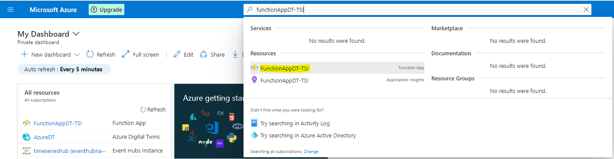

_____________________________________________________________________________________________
Now , whenever the Digital twin instance receives data, the Azure function is triggered and sends data from DT to TSI.


### 1.7 Connect TransformTwinData to ADT and TSI

Azure functions is a serverless concept of cloud native design that allows a
piece of code deployed and execute without any need of server infrastructure,
web server, or any configurations. Azure functions can be written in multiple
languages such as C, Java, JavaScript, TypeScript, and Python. We are using C
language as it has a predefined project template for creating the Azure Function.
Azure function supports Event Hub Trigger and is executed automatically
when event is fired from Azure Digital Twin


#### 1.7.1 Create new Event Hub namespace in Azure

Search for event hub and create new Event Hub namespace with name and
resource group. Event Hub namespace will receive events from your Azure
Digital Twins instance, You’ll be using this event hubs namespace to hold the
two event hubs:

1. Twins hub - Event hub to receive twin change events
2. Time series hub - Event hub to stream events to Time Series Insights
3. Create Twins Hub:
    Create new Event Hub inside Event Hub namespace by clicking add but-
    ton. This event hub will receive twin change events from Azure Digital
    Twins. To set up the twins hub, you’ll complete the following steps in this
    section:

```
(a) Create an authorization rule to control permissions to the hub
(b) Create an endpoint in Azure Digital Twins that uses the authoriza-
tion rule to access the hub
(c) Create a route in Azure Digital Twins that sends twin updates event
to the endpoint and connected twins hub
(d) Get the twins hub connection string
```
- Create twins hub authorization rule.

     Go to the created event hub,inside the event hub namespace and select shared access policies from side menu and click on add button for creating new authorization policy and choose Send and Listen for the authorization rule as highlighted below.

    

- Create twins hub endpoint Create an Azure Digital Twins end-
    point that links your event hub to your Azure Digital Twins
    instance. Specify a name for your twins hub endpoint. Go to
    Digital Twin and choose Endpoints from side menu
    *Endpoint type**- choose Event Hub


```
*Subscription**- choose your azure subscription
*Event hub namespace** and **Event Hub**- choose already
created event hub namespace and event hub name
*Authentication type**- key based
*Authorization rule**- choose already created twin hub autho-
rization rule
```
- Create twins hub event route Azure Digital Twins instances can
    emit twin update events whenever a twin’s state is updated. In
    this section, you’ll create an Azure Digital Twins **event route**
    that will direct these update events to the twins hub for further
    processing.
    Create a route in Azure Digital Twins to send twin update events
    to your endpoint from above. The filter in this route will only
    allow twin update messages to be passed to your endpoint. Specify a name for the twins hub event route. choose an already created
    endpoint name.
    
- Get twins hub connection string Go to the event hub namespace
    and click on the created twins hub below , choose shared access
    policies and click on created twins hub authorization rule , you
    can see the detailed view , copy the primary connection string
    as highlighted in the below image
    
    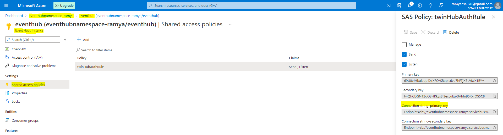
4. Create time series hub
similar to twins hub create time series hub inside the existing event hub
namespace
- Create time series hub authorization rule
  Go to the created time series hub inside the event hub namespace
  and select shared access policies from side menu and click on add
  button for creating new authorization policy and choose Send and
  Listen for the authorization rule as highlighted below.

  

- Get time series connection string
  Go to the event hub namespace and click on the created time series
  hub below , choose shared access policies and click on created time
  series hub authorization rule , you can see the detailed view , copy
  the primary connection string as highlighted in the below image

  
5. Create Azure Function in C#
- Create Azure Function with Event Hub Trigger
Create a new C# project and choose Azure Function as Project template
Choose the Event Hub trigger that runs whenever event is fired in
Azure Digital Twin
- Go to project file [ProcessDTTelemetryUpdateTSI.cs](https://github.com/derlehner/DigitalTwin_Airquality_For_Covid_Risk_Assessment/blob/main/digital_twin/azure/AirQualityUseCase/AirQualityDataProcessing/ProcessDTTelemetryUpdatetoTSI.cs)
  Set up the connection string name for eventhub twins and time series
  insights according to your project. Provide the EventHubTrigger and
  EventHub with twin hub and time series hub name as we created
  earlier in Azure event hub namespace.


```
copy paste the contents from ProcessDTTelemetryUpdateTSI.cs to
your new project or use the existing AirQualityDataProcessing project
with solution file and set this as start-up project in visual studio.
```
```
make a note of both the twin and time series hub connection string to use
them in tha Azure function below.
```
#### 1.7.2 Create time series hub

similar to twins hub create time series hub inside the existing event hub namespace
a) Create time series hub authorization rule
Go to the created time series hub inside the event hub namespace and select
shared access policies from side menu and click on add button for creating new
authorization policy and choose Send and Listen for the authorization rule as
highlighted below


b) Get time series connection string
Go to the event hub namespace and click on the created time series hub below
, choose shared access policies and click on created time series hub authorization
rule , you can see the detailed view , copy the primary connection string as
highlighted in the below image


make a note of both the
twin and time series hub connection string to use them in the Azure function
below.
Create Azure Function in C#
Create Azure Function with Event Hub Trigger
a) Create a new C# project and choose Azure Function as Project template
 

b) Choose the Event Hub trigger
that runs whenever event is fired in Azure Digital Twin


## 2. Implementation of Use Case
In this section, we describe the implementation of our air quality use case as described above. As an example, we use the following setting of our use case that has to be created in the Azure Setup described above.

The Room with name "Room101" contains a Controller called "Raspberry1" and has a connected "CO2Sensor" and "LED".
The Room with name "Room102" contains a Controller called "Raspberry2" and has a connected "CO2Sensor" and "LED".
The Room with name "Lobby100" contains a Controller called "Raspberry3" and has a connected "CO2Sensor" and "LED".
Both CO2Sensors send co2Values, and the LEDs have a Property called "color" that indicate the color in which it is currently blinking (NONE if the LED is turned off).
To implement this setting in Azure, the following steps are necessary.
1. Specify Digital Twins
2. Create Digital Twins in ADT and TSI
3. Create Endpoints for Devices in IoT-Hub

These steps are described in more detail below.

### 2.1. Specify Digital Twins
First, information of the physical devices must be specified in some order. This information must be defined on the following two levels of abstraction:

Interfaces: Therefore, we use the Digital Twins Definition Language (DTDL) - Version 2 offered by Microsoft. The folder /create_twins/interface_models contains the json files of the interfaces required for our use case, namely Room, AirQualityController and AirQualitySensor.In order to allow automation in Step 2, created files must be placed into the folder /create_twins/interface_models.
Digital Twins: represent specific devices that conform to the structure imposed by their models. We use the format imposed by the ADT-service as json representation. The folder /create_twins/twin_models contains the json files of the Digital Twins required for our use case, namely Room101, Room102, Lobby100, Raspberry1, Raspberry2 and Rapsberry3. In order to allow automation in Step 2, created files must be placed into the folder /create_twins/twin_models.

### 2.2. Create Digital Twins in ADT and TSI
This information can be automatically set up using the json files described in Step 1 and the automation script provided in Folder /create_twins. In order to perform this step, the following prerequisites must be met:

- **Installation of required python libraries:** Install Libraries json and urllib3. Therefore, open a Terminal and enter the following two commands:
```python
pip install json
pip install urllib3
```
- **Download of Azure CLI:** To interact with your azure account from your computer, you need to install Azure CLI. With Azure CLI it is possible to sign into your Azure account and do most
  of the steps, that are possible at the Azure Portal homepage. It is recom-
  mended to install Azure CLI because it is the easiest way to log into your
  Azure account and some steps are done via Azure CLI in the documentation.
  The reference for Azure CLI is [available online](https://docs.microsoft.com/en-
  us/cli/azure/reference-index?view=azure-cli-latest).
  Azure CLI is available for Windows, macOS and Linux. There is a [related
  documentation](https://docs.microsoft.com/en-us/cli/azure/install-azure-cli) avail-
  able for the different operating systems. After the installation it is possible
  to access Azure via terminal with the keyword ```az```. There are extensions of
  commands that are related to [Digital Twins](https://docs.microsoft.com/en-
  us/cli/azure/ext/azure-iot/dt?view=azure-cli-latest) (keyword ```az dt```) and [IoT hub](https://docs.microsoft.com/en-
  us/cli/azure/iot?view=azure-cli-latest) (keyword ```az iot```).

- **Login into Azure CLI:** After Azure CLI is installed on your PC, you can login via the command ```az login```.

- **Adaptation of base_url and auth_token for ADT:** In the file [digital_twin_api.py](https://github.com/derlehner/DigitalTwin_Airquality_For_Covid_Risk_Assessment/blob/main/digital_twin/azure/create_twins/digital_twin_api.py), you have to adapt the base_url in line 6 and auth_token in line 7 with the information from your azure setup. 
 
- To get the base_url, go to ADT in your Azure Account and select overview section from the side menu, you can see the essential details about the DT environment as shown below,copy paste url from the Host name property.
 
 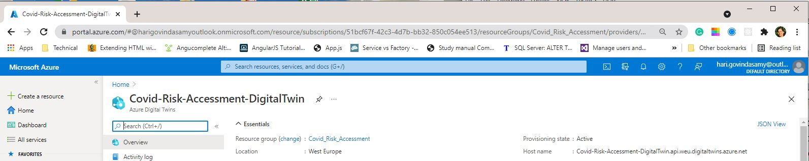
 
-  To get the auth_token, enter the following command in the Azure CLI:
 ```az account get-access-token --resource 0b07f429-9f4b-4714-9392-cc5e8e80c8b0```
 
- **Adaptation of base_url and auth_token for TSI:** In the file [tsi_api.py](https://github.com/derlehner/DigitalTwin_Airquality_For_Covid_Risk_Assessment/blob/main/digital_twin/azure/create_twins/tsi_api.py), adapt base_url in line 6 and auth_token in line 7 with the information from your azure setup. 

- To get the base_url, go to the TSI environment and select overview section from the side menu, you can see the essential details about the TSI environment as shown below, copy paste url from the Data Access FQDN property .

   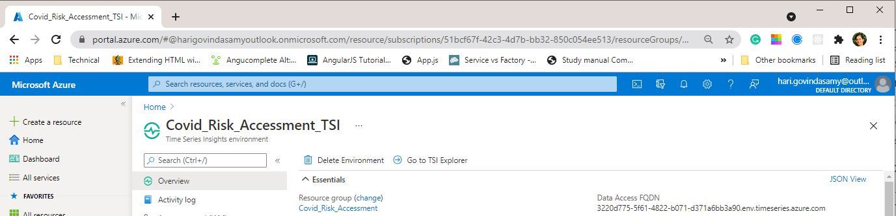

- To get the auth_token, enter the following command in the Azure CLI:
 ``` az account get-access-token --resource 120d688d-1518-4cf7-bd38-182f158850b6```


After these prerequisites are met, the models and twins described in the folders interface_models and twin_models are created in the ADT and TSI service.

### 2.3. Create Endpoints for Devices in IoT-Hub
For every physical device that sends data to Azure, a dedicated device must be created in Azure IoT-Hub.

Prerequisites:

1. Set up Azure IoT Hub

Next step is to create IoT devices.

For every physical device that sends data to Azure, a dedicated device must be created in Azure IoT-Hub, in order to create a digital twin of the physical device.

In our use-case [twin_models](https://github.com/derlehner/DigitalTwin_Airquality_For_Covid_Risk_Assessment/tree/development/digital_twin/create_twins/twin_models) we have three different raspberry pi's for three different rooms. So, let us go ahead and create them in Azure IoT Hub.

sample 1:

Raspberry1-Lobby100.json

In this sample we want to create IoT device with device id as **Raspberry1** as we have mentioned the digital twin id with property **dtid** in the  [Raspberry1.json](https://github.com/derlehner/DigitalTwin_Airquality_For_Covid_Risk_Assessment/blob/development/digital_twin/create_twins/twin_models/Raspberry1.json) while creating the model instance of digital twin.


After successful creation of IoT device, we can view them under IoT devices section inside IoT Hub.

 

Similarly create IoT devices in accordance with the twin_models. As per our use case we have created the IoT devices with names Raspberry2 and Raspberry3.

After creation the final output will be as follows.

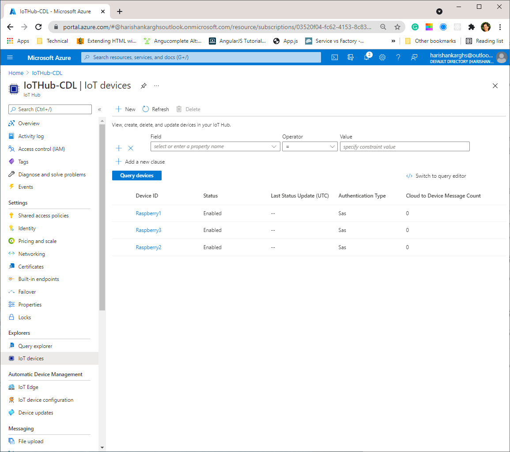 

We have created the IoT device name in accordance with twin models because of the following reasons:

1. We want to automatically update the Digital twin with device data that IoT device receives
2. The device data that we send to IoT Hub device is transmitted to Digital twin internally by Azure function.

### 2.4. Results
After all of the steps mentioned above (setting up azure + creating digital twins for the use case) are performed, the following functionality is available.
1. Data can be sent from the physical system to the respective Digital Twins via the created endpoints in the IoT-Hub
2. Available Digital Twins and their metadata can be queried and visualized via the ADT-Explorer (see example visualization below, read more about ADT-Explorer in the [Visualization Application](https://github.com/derlehner/IndoorAirQuality_DigitalTwin_Exemplar/tree/main/applications/visualisation)


3. Historical data sent by different devices can be queried using TSI and visualized using the TSI-Explorer (see example visualization below, read more about TSI-Explorer in the [Visualization Application](https://github.com/derlehner/IndoorAirQuality_DigitalTwin_Exemplar/tree/main/applications/visualisation)


