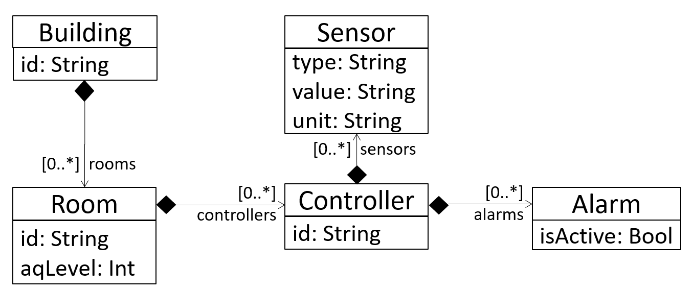
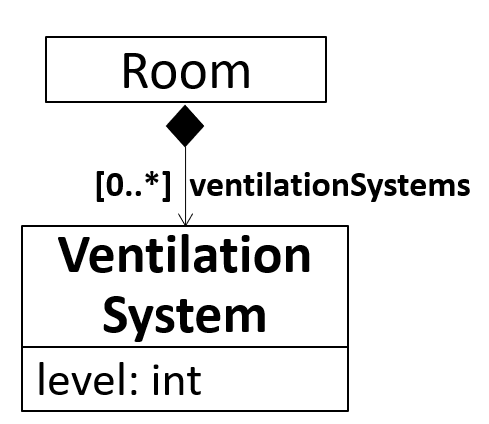
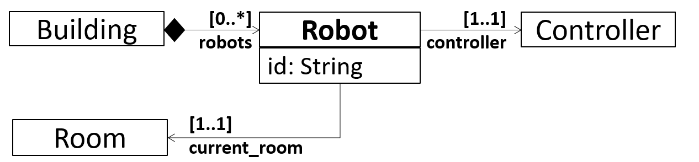

# Models

To provide a basis for discussion, we provide example models for three different maturity levels of the overall system using the Unified Modeling Language (UML) and AutomationML.

## Baseline

In a baseline system, a Building consists of several Rooms. These rooms contain controllers, which are again connected to sensors (to get air quality data from the room) and alarms (to give notifications to the room). This setting is visualized below, and modeled in [Baseline.uml](./baseline.uml) and [Baseline.aml](./baseline.aml). We also provide example instantiations in [Baseline_Instances.uml](./baseline_instances.uml) and [Baseline.aml](./baseline.aml).

## Evolution Scenario 1

In a first evolution scenario, we add a Ventilation System that can be used to improve air quality in a specific room. The required adaptations are visualized below, and the whole adapted model is available in [evolution_scenario_1.uml](./evolution_scenario_1.uml) and [evolution_scenario_1.aml](./evolution_scenario_1.aml).

## Evolution Scenario 2

In a second evolution scenario, we introduce mobile robots to the system. The Controllers are put on these robots instead of the rooms, and the robots can dynamically move between different rooms to measure air quality for these specific rooms. The required adaptations are visualized below, and the whole adapted model is available in [evolution_scenario_2.uml](./evolution_scenario_2.uml) and [evolution_scenario_2.aml](./evolution_scenario_2.aml).

