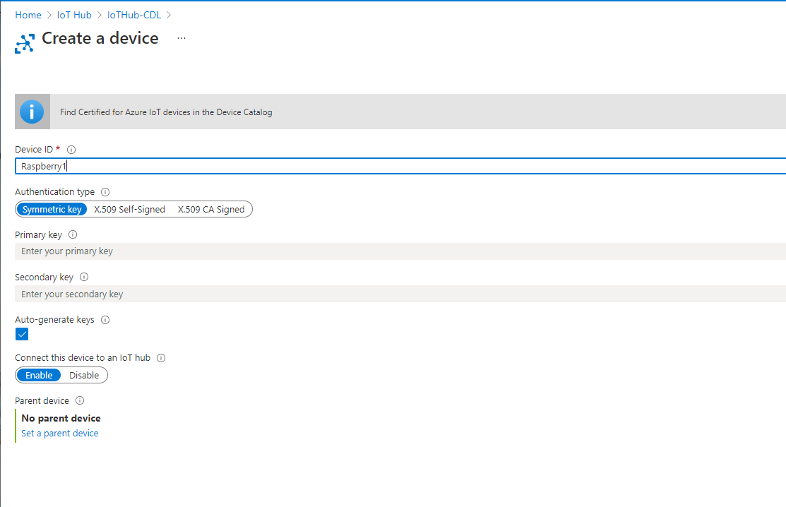
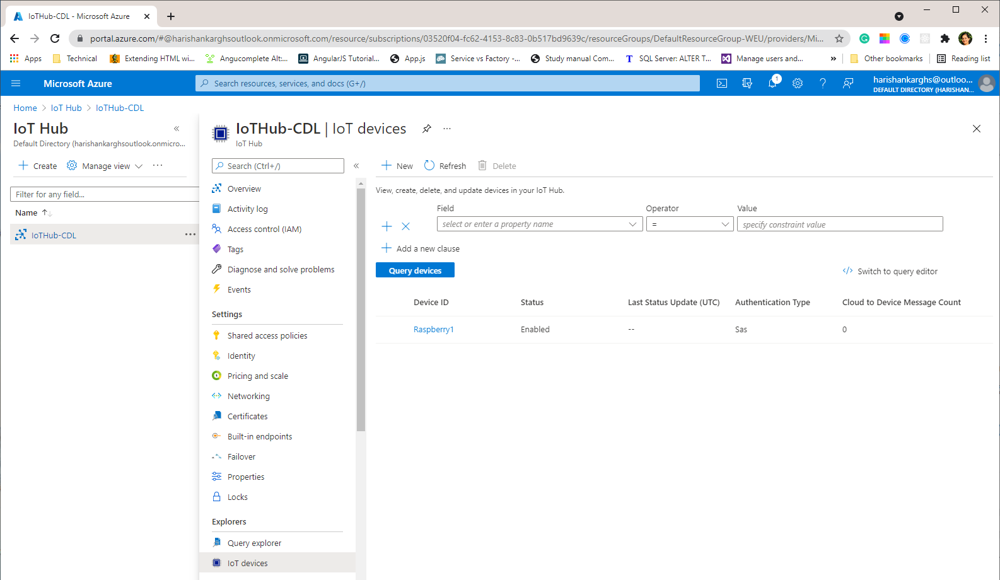

# Digital Twin
Digital Twins normally defineed as exact replica of the physical obejcts. Here in our case we build exact replica of our entire archtecture like our systems in real world which will be the core idea of our project to use Digital Twin to monitor, visualize and control the entire systems.
Azure Digital Twins is an Internet of Things (IoT) platform that enables you
to create a digital representation of real-world things, places, and business pro-
cesses. Azure Digital Twins is an IoT platform that enables the creation of
comprehensive digital models of entire environments to gain insights that drive
better products, optimization of operations, cost reduction and breakthrough
customer experiences. Examples include buildings, factories. 

## Contents
- Introduction 
- 1 Setup Digital Twin Infrastructure in Azure
   - 1.1 Create an Azure Account
   - 1.2 Setup IoT-Hub
   - 1.3 Setup Azure Digital Twins Service (ADT)
   - 1.4 Setup Azure Function 1: ExtractDeviceData
   - 1.5 Connect ExtractDeviceData to IoT-Hub and ADT
   - 1.5 Setup Time Series Insights Service (TSI)
   - 1.6 Setup Azure Function 2: TransformTwinData
   - 1.7 Connect TransformTwinData to ADT and TSI
- 2 Implementation of Use Case
   - 2.1 Specify Digital Twins
   - 2.2 Create Digital Twins in ADT and TSI
   - 2.3 Create Device Endpoints in IoT-Hub

### 1.1 Setup Digital Twin Infrastructure in Azure
we have several parts in azure, will be described each and every on here as follows:
- IoT Hub: Used to receieve the data from raspbrerry via 'connection_string' and used to pass data to other azure services. IoT-Hub also manages the devices from the physicalsystem and collects data sent by these devices to forwardthem to the Digital Twin (ADT) Service
- Digital Twins: Our Digital Twin will contain the physical archetecture like, number of building and rooms in it what the current data and so on. It will be act like monitoring systems if the user needs to anazlysing realtime data.
- Time Series Insights: is to visualize the data over past time for example 1 month of data and see used to pass the data to our use case applications like Machine Learining, Visualisation and physical modelling.
- Function App1: ExtractDeviceData is the triggering function app which used to bring the data from Iot-hub to Digital Twins
- Function App2: TransformTwinData is the triggering function app which used to bring the data from Digital twins to Time series insights.

#### 1.1.1 Create Azure Account

Microsoft Azure is a cloud solution with a lot of resources and services. The
once that are interesting for this project and are covered by this documentation.
The following sections describe the relevant steps to get an Azure Setup needed
for this project. All information covered by this chapter are also covered by
the documentation of Microsoft. It is possible to get a free Microsoft Azure
account, but it is recommended to create an Microsoft Azure student account,
because it will apply$100 credit to the account.To create an Microsoft Azure
student account it is necessary to have 2 different e-mail addresses which is
the academic e-mail address (@jku.at) to verify you are eligible or the student
account, another e-mail address, that will be used as login and main e-mail
address for Azure. Follow the process:

1. Go to this link and click ”free account” on top right.
2. On next page click ”start for free”
3. Enter your data and your account will be created.


### 1.2 Setup IoT-Hub

**IoT Hub** is a Platform-as-a-Services (PaaS) managed service, hosted in
the cloud, that acts as a central message hub for bi-directional commu-
nication between an IoT application and the devices it manages. This is
one of the services which Azure enables highly secure and reliable communi-
cation between your Internet of Things (IoT) application and the devices it
manages. Azure IoT Hub provides a cloud-hosted solution back end to con-
nect virtually any device. IoT Hub is the entry point to the data which
we actually want to work on after receiving here we have huge options to
work on with. We can use the IoT app as a source for other azure services.
In this section an Azure IoT hub will be created. A related documentation
is part of the [linked Quickstart](https://docs.microsoft.com/en-us/azure/iot-
hub/quickstart-send-telemetry-pythoncreate-an-iot-hub). 
Usage:

- Manage IoT Devices (make successful connections for data transfer)
- You can send Telemetry-data securely from physical hardware (sensor)
    to Azure. For info [refer this website](https://docs.microsoft.com/en-
    us/azure/iot-hub/quickstart-send-telemetry-python)
- Using ‘Message Routing’ option telemetry messages can be sent to : Events,
    Storage, Event Hubs and much more.
    **[DL] The general description of IoT-Hub can be shortened and put into the introduction at the top of this readme file. This part should be rather about setting up the IoT-Hub.**

1. In the azure resources search for IoT Hub
2. click create
3. Using this required data create the azure app. The required data:
- Resource group
- Resource Locationd
- IOT hub Name
4. You will be created the azure IoT-Hub app now.
**[DL] We should add some screenshots here to show how IoT-Hub is created**

#### 1.2.1 Device Creation

After this we can create a new device. **[DL] What do we need this device for??**
2. In the IoT-Hub app go to IoT devices section from left side, then you will
    able to view all the available devices if any.


3. Click ”new” button on top and enter the preferred name for a device and
    then save it.
4. Now you have been created new device now.

**[DL] Again, add a screenshot!**


### 1.3 Setup Azure Digital Twins Service (ADT)

In this section a Digital Twins platform will be created. A related doc-
umentation is part of the [linked Quickstart](https://docs.microsoft.com/en-
us/azure/digital-twins/quickstart-adt-explorer).

1. Search for”Azure Digital Twin” in [azure resource](https://portal.azure.com)
2. You will need to press the Button "+ Add" at the Azure Digital Twins page. **[DL] Screenshot for steps 1 + 2]**
3. At the next page you will have to add **[DL] Screenshot for step 3**
    - a resource group,
    - location and
    - a name for the Digital Twins service.

In above figure you can find the”Host Name”where you can find in DT
homepage is the string should be noted. 
It is used further for installing ADT Explorer. The resource group will be later used for all other resources related to the AirQuality project. It needs to be created, if this wasn’t done before.
To do so, press the Create new button below the Resource group selection. You only
need a name or the resource group to do so. Regarding location, it is worth
to mention that the Digital Twins resource is only available for Australia East,
East US, East US 2, North Europe, South Central US, Southeast Asia, UK
South, West Central US, West Europe and West US 2 at the moment. These
locations are the locations of the Azure servers. For the current instance for the
AirQuality project the locationWest Europewas chosen. If everything is filled
out, you can continue by clicking the Review + createbutton at the lower left
corner. A short summery to check again will be listed. By pressing theCreate-
button in the lower left corner you will finish the creation. The deployment will
take some. A window in the upper right corner will show you a message when
completed.

#### 1.3.1 Digital Twin Explorer
**[DL] Please read through the whole text again and check for missing spaces.**
**[DL] This should not be here. We could either describe this in Part 2, or leave it out at all.**
Digital Twin Exploreris the easy way to visualise our model architecture, import,
export our models. This should be installed in our pc. Requirements for DT
Explorer: Node.js (not less then version 10), npm. The process to install DT
Explorer:

1. Installing node.js on ubuntu by command line: 
```
sudo a p t i n s t a l l c u r l
curl sL https://deb.nodesource.com/setup10.x — sudo E bash
sudo apt install node js 
```
2. Download and extract the Digital Twin Ex-
plorer files. DownloadandextracttheDigitalT winExplorerf iles[f romthegit]()
3. Run terminal under this directory: digital-twins-explorer-main/client/src
4. Run the command: to install the npm npm i n s t a l l 5. Run the
command: to start the DT Explorer 
```
npm run start
```
1.3.2 To connect DT explorer to your Azure DT:

1. Copy host name from your Digital twin home page, and add‘https://’ in front
for example: https://DigitalTwin-DigitalTwinApp.api.weu.digitaltwins.azure.net
2. Then click login icon on top right on DT explorer you already opened Paste
the string here and click ok. You will be now connected to the azure

1.3.3 Creating and uploading the model

1. All dt models should be written in .json file
    2. Open your favourite code editor and create new .json file ¡img align=”center”
    src=”pictures/dtexplorer.png” width= 400/¿
    3. This code above is the example simple model which contains ‘temper-
    ature’ and ‘Humid- ity’: It is based on azure dtdl language. [More about
    it](https://docs.microsoft.com/en-us/azure/digital-twins/concepts-models) 4. For
    uploading click the upload button on DT explorer and select the .json file you
    created before. Then your model will be shown below.
    ¡img align=”center” src=”pictures/uploadmodel.png” width= 200/¿
    5. Then finally the model is created and will be visualised if added to
    explorer. ¡img align=”center” src=”pictures/dtmodel.png” width= 400/¿


### 1.4 Setup Azure Function 1: ExtractDeviceData

### 1.7 Connect ExtractDeviceData to IoT-Hub and ADT

### 1.5 Setup Time Series Insights Service (TSI)

### 1.6 Setup Function 2: TransformTwinData

### 1.7 Connect TransformTwinData to ADT and TSI

Azure functions is a serverless concept of cloud native design that allows a
piece of code deployed and execute without any need of server infrastructure,
web server, or any configurations. Azure functions can be written in multiple
languages such as C, Java, JavaScript, TypeScript, and Python We are using C
language as it has predefined project template for creating the Azure Function.
Azure function supports Event Hub Trigger and is executed automatically
when event is fired from Azure Digital Twin
**[DL] The general description of Azure Functions can be shortened and put into the introduction at the top of this readme file. This part should be rather about describing and setting up this specific azure function.**

#### 1.7.1 Create new Event Hub namespace in Azure

Search for event hub and create new Event Hub namespace with name and
resource group. Event Hub namespace will receive events from your Azure
Digital Twins instance, You’ll be using this event hubs namespace to hold the
two event hubs:

1. Twins hub - Event hub to receive twin change events
2. Time series hub - Event hub to stream events to Time Series Insights
3. Create Twins Hub:
    Create new Event Hub inside Event Hub namespace by clicking add but-
    ton. This event hub will receive twin change events from Azure Digital
    Twins. To set up the twins hub, you’ll complete the following steps in this
    section:

```
(a) Create an authorization rule to control permissions to the hub
(b) Create an endpoint in Azure Digital Twins that uses the authoriza-
tion rule to access the hub
(c) Create a route in Azure Digital Twins that sends twin updates event
to the endpoint and connected twins hub
(d) Get the twins hub connection string
```
- Create twins hub authorization rule Go to the created event hub
    inside the event hub namespace and select shared access policies
    from side menu and click on add button for creating new autho-
    rization policy and choose Send and Listen for the authorization
    rule as highlighted below
- Create twins hub endpoint Create an Azure Digital Twins end-
    point that links your event hub to your Azure Digital Twins
    instance. Specify a name for your twins hub endpoint. Go to
    Digital Twin and choose Endpoints from side menu
    *Endpoint type**- choose Event Hub


```
*Subscription**- choose your azure subscription
*Event hub namespace** and **Event Hub**- choose already
created event hub namespace and event hub name
*Authentication type**- key based
*Authorization rule**- choose already created twin hub autho-
rization rule
```
- Create twins hub event route Azure Digital Twins instances can
    emit twin update events whenever a twin’s state is updated. In
    this section, you’ll create an Azure Digital Twins **event route**
    that will direct these update events to the twins hub for further
    processing.
    Create a route in Azure Digital Twins to send twin update events
    to your endpoint from above. The filter in this route will only
    allow twin update messages to be passed to your endpoint. Spec-
    ify a name for the twins hub event route. choose already created
    endpoint name.
- Get twins hub connection string Go to the event hub namespace
    and click on the created twins hub below , choose shared access
    policies and click on created twins hub authorization rule , you
    can see the detailed view , copy the primary connection string
    as highlighted in the below image
4. Create time series hub
similar to twins hub create time series hub inside the existing event hub
namespace
- Create time series hub authorization rule
Go to the created time series hub inside the event hub namespace
and select shared access policies from side menu and click on add
button for creating new authorization policy and choose Send and
Listen for the authorization rule as highlighted below.
- Get time series connection string
Go to the event hub namespace and click on the created time series
hub below , choose shared access policies and click on created time
series hub authorization rule , you can see the detailed view , copy
the primary connection string as highlighted in the below image
5. Create Azure Function C
- Create Azure Function with Event Hub Trigger
Create a new C project and choose Azure Function as Project tem-
plate
Choose the Event Hub trigger that runs whenever event is fired in
Azure Digital Twin
- Go to project folder→code→AirQualityDataProcessing→AirQualityDataProcessing→ProcessDTTelemetryUpdateTSI.cs
- ProcessDTTelemetryUpdateTSI.cs
Set up the connection string name for eventhub twins and time series
insights according to your project. Provide the EventHubTrigger and
EventHub with twin hub and time series hub name as we created
earlier in Azure event hub namespace.


```
copy paste the contents from ProcessDTTelemetryUpdateTSI.cs to
your new project or use the existing AirQualityDataProcessing project
with solution file and set this as start-up project in visual studio.
```
```
make a note of both the twin and time series hub connection string to use
them in tha Azure function below.
```
#### 1.7.2 Create time series hub

similar to twins hub create time series hub inside the existing event hub names-
pace
a) Create time series hub authorization rule
Go to the created time series hub inside the event hub namespace and select
shared access policies from side menu and click on add button for creating new
authorization policy and choose Send and Listen for the authorization rule as
highlighted below
”.-auth-rule.png” is not created yet. Click to create. b) Get time series
connection string
Go to the event hub namespace and click on the created time series hub below
, choose shared access policies and click on created time series hub authorization
rule , you can see the detailed view , copy the primary connection string as
highlighted in the below image
”.-conn-str.png” is not created yet. Click to create. make a note of both the
twin and time series hub connection string to use them in tha Azure function
below.
Create Azure Function C
Create Azure Function with Event Hub Trigger
a) Create a new C project and choose Azure Function as Project template
”..png” is not created yet. Click to create. b) Choose the Event Hub trigger
that runs whenever event is fired in Azure Digital Twin
”..png” is not created yet. Click to create.

## 2. Implementation of Use Case
In this section, we describe the implementation of our air quality use case as described above. As an example, we use the following setting of our use case that has to be created in the Azure Setup described above.

The Room with name "Room101" contains a Controller called "Raspberry1" and has a connected "CO2Sensor" and "LED".
The Room with name "Room102" contains a Controller called "Raspberry2" and has a connected "CO2Sensor" and "LED".
The Room with name "Lobby100" contains a Controller called "Raspberry3" and has a connected "CO2Sensor" and "LED".
Both CO2Sensors send co2Values, and the LEDs have a Property called "color" that indicate the color in which it is currently blinking (NONE if the LED is turned off).
To implement this setting in Azure, the following steps are necessary.

### 2.1. Specify Digital Twins
First, information of the physical devices must be specified in a way This information must be defined on the following two levels of abstraction:

Interfaces: Therefore, we use the Digital Twins Definition Language (DTDL) - Version 2 offered by Microsoft. The folder /create_twins/interface_models contains the json files of the interfaces required for our use case, namely Room, AirQualityController and AirQualitySensor.In order to allow automation in Step 2, created files must be placed into the folder /create_twins/interface_models.
Digital Twins: represent specific devices that conform to the structure imposed by their models. We use the format imposed by the ADT-service as json representation. The folder /create_twins/twin_models contains the json files of the Digital Twins required for our use case, namely Room101, Room102, Lobby100, Raspberry1, Raspberry2 and Rapsberry3. In order to allow automation in Step 2, created files must be placed into the folder /create_twins/twin_models.

### 2.2. Create Digital Twins in ADT and TSI
This information can be automatically set up using the json files described in Step 1 and the automation script provided in Folder /create_twins. In order to perform this step, the following prerequisites must be met:

- **Installation of required python libraries:** Install Libraries json and urllib3. Therefore, open a Terminal and enter the following two commands:
```python
pip install json
pip install urllib3
```
- **Download of Azure CLI:** To interact with your azure account from your computer, you need to install Azure CLI. With Azure CLI it is possible to sign into your Azure account and do most
of the steps, that are possible at the Azure Portal homepage. It is recom-
mended to install Azure CLI because it is the easiest way to log into your
Azure account and some steps are done via Azure CLI in the documentation.
The reference for Azure CLI is [available online](https://docs.microsoft.com/en-
us/cli/azure/reference-index?view=azure-cli-latest).
Azure CLI is available for Windows, macOS and Linux. There is a [related
documentation](https://docs.microsoft.com/en-us/cli/azure/install-azure-cli) avail-
able for the different operating systems. After the installation it is possible
to access Azure via terminal with the keyword ```az```. There are extensions of
commands that are related to [Digital Twins](https://docs.microsoft.com/en-
us/cli/azure/ext/azure-iot/dt?view=azure-cli-latest) (keyword ```az dt```) and [IoT hub](https://docs.microsoft.com/en-
us/cli/azure/iot?view=azure-cli-latest) (keyword ```az iot```).
- **Login into Azure CLI:** After Azure CLI is installed on your PC, you can login via the command ```az login```.
- **Adaptation of base_url and auth_token for ADT:** In the file digital_twin_api.py, you have to adapt the base_url in line xx and auth_token in line xx with the information from your azure setup. To get the base_url, go to ADT in your Azure Account and copy the host name. DigitalTwin To get the auth_token, enter the following command in the Azure CLI:
 ```az account get-access-token --resource 0b07f429-9f4b-4714-9392-cc5e8e80c8b0```
- **Adaptation of base_url and auth_token for TSI:** In the file tsi_api.py, adapt base_url in line xx and auth_token in line xx with the information from your azure setup. To get the base_url, TODO:describe. To get the auth_token, enter the following command in the Azure CLI:
 ``` az account get-access-token --resource 120d688d-1518-4cf7-bd38-182f158850b6```


After these prerequisites are met, the models and twins described in the folders interface_models and twin_models are created in the ADT and TSI service.

### 2.3. Create Endpoints for Devices in IoT-Hub
For every physical device that sends data to Azure, a dedicated device must be created in Azure IoT-Hub, in order to... TODO: Describe what we need device for TODO: Describe individual steps required to create device(s) for Digital Twins mentioned above. @Ramya: please add this here!

Prerequisites:

1. Set up Azure IoT Hub

Next step is to create IoT devices.

For every physical device that sends data to Azure, a dedicated device must be created in Azure IoT-Hub, in order to create a digital twin of the physical device.

In our use-case [twin_models](https://github.com/derlehner/DigitalTwin_Airquality_For_Covid_Risk_Assessment/tree/development/digital_twin/create_twins/twin_models) we have three different raspberry pi's for three different rooms. So, let us go ahead and create them in Azure IoT Hub.

sample 1:

Raspberry1-Lobby100.json

In this sample we want to create IoT device with device id as **Raspberry1** as we have mentioned the digital twin id with property **dtid** in the  [Raspberry1.json](https://github.com/derlehner/DigitalTwin_Airquality_For_Covid_Risk_Assessment/blob/development/digital_twin/create_twins/twin_models/Raspberry1.json) while creating the model instance of digital twin.



After successful creation of IoT device, we can view them under IoT devices section inside IoT Hub.

 

Similarly create IoT devices in accordance with the twin_models. As per our use case we have created the IoT devices with names Raspberry2 and Raspberry3.

After creation the final output will be as follows.

 

We have created the IoT device name in accordance with twin models because of the following reasons:

1. We want to automatically update the Digital twin with device data that IoT device receives
2. The device data that we send to IoT Hub device is transmitted to Digital twin internally by Azure function.


 
