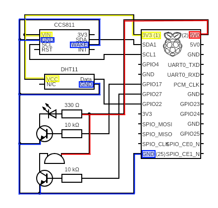

# Setup Physical Twin with actual hardware

## Contents
- Prerequisites
- Hardware setup
	- Sensor CCS811 (CO2 measurement)
	- Raspberry Pi
	- Wiring of Hardware
- Initial Setup of Raspberry OS
	- Remote access via SSH
	- Deploy Code to Raspberry
	- Required Libraries for the project
	- Code
- Possilble Frequent Errors:

## Prerequisites
- Raspberry and accessories
- CCS811 and DHT11 Sensors
- Electronics like resistors, LED lights 
- Bread board and connection wires

## Hardware setup
### Raspberry Pi
 We ue [Raspberry Pi 4](https://www.raspberrypi.org/products/raspberry-pi-4-model-b/) boards. Raspberry is a dedicated computer with all neccesary functions just like an ordinary pc.  The raspberry sends measured co2 values to the cloud and is also used to command the treshold triggers if the values reach above the limit by changing the color of the LED or by Beeping sounds. 
 
 
 An alternative would be NVIDIA's [Jetson Nano](https://developer.nvidia.com/embedded/jetson-nano-developer-kit). However in this project a Raspberry is used and for this following hardware for setting up the raspberry is needed:
- (Fully Integrated) Raspberry Pi 4 - Board
- Power adapter for Raspberry Pi 4 (USB-C)
- SD-card
- LAN-cable
- Card-Reader (for initialization)
- Keyboard (for initialization)
- Micro-HDMI to HDMI cable (for initialization)

### Sensor CCS811 (CO2 measurement)
- This [Adafruit CCS811](https://joy-it.net/en/products/SEN-CCS811V1) sensor is using the I2C protocol, because of that, the I2C was enabled in raspi-config. The
- Wiring is simple, the `SDA` (data) and `SCL` (clock) pins of the sensor need to be connected to
- The SDA and SCL pins on the Raspberry Pi. It is based on the `MOS` (metal oxide semiconductor) principle and can provide a total volatile organic compound (tVOC) or carbon dioxide equivalent (eCO2) level as well as a temperature value. The eCO2 value is not as accurate as an CO2 value and can only be used as a reference.
- To get valid data a initial burn-in of 48 hours and a warm-up time of 20 min is recommended.
- There are datasheet and manual available at the homepage of joy-it. The manual also includes an example of how to access the sensor in code. A short summery is available in (subsection - 1.6.4) datasheet documentation and manual are located at the repository for further information.

### Wiring of Hardware
Raspberry Pi GPIOs are limited to max. 15 mA current per pin and 50 mA over all GPIOs.
It is recommended to use transistors to keep the current on the GPIOs at a minimum. A
transistor has 3 pins and is connected between the GPIO and the component, which should be connected to the GPIO. The current is taken from the 3.3 V or 5 V supply pin and it needs to be connected to the ground too. The transistor prevents that the component is using too much current from the GPIO and instead is using the voltage supply pin to power the components.

For wiring the hardware we should follow some documentations for the sensors and the raspberry pi. The required pinout connections are as follows: _for reference pin layout for the raspberry is also shown in the image_

| 	Pin 	| 	type 	| 	GIPO 	|
|	---		|	---		|	---		|
| 	Sensor	|	`SDA` 	| 	GPIO 2	|
| 	Sensor 	| 	`SCL` 	| 	GPIO 3	|
| 	Sensor 	| 	`+vcc` 	| 	+5v 	|
|	Sensor	|	`Ground`	| 	Grnd	|
|	Sensor	| 	`init`	|	Grnd	|

 

## Initial Setup of Raspberry OS
After having the new Raspberry or when Need to flash old raspberry to install new  Ubuntu.
Required Things:
1. Brand new Raspberry / Raspberry that need to be flashed new
2. Download thePi Imagerfile and install it from [this link](https://ubuntu.com/tutorials/how-to-install-ubuntu-on-your-raspberry-pi#)
3. If your in Linux InstallPi Imagerby following the command
```sh
 sudo snap install rpi-imager
```
4. choose the OS as [Raspberry pi OS](https://www.raspberrypi.org/software/) 32 bitprobably it will be in first option


6. insert the sd card and click write
7. After it has been installed you can insert this sd card into raspberry and you have an updated version of linux
    installed on you device.

For the setup of the Raspberry Pi an introduction is given on the Raspberry Pi's official homepage.
In the following section a short overview is given.
First of all an operating system needs to be downloaded and an image needs to be installed
on the SD-card. For this step the Card-Reader is needed. For this project the Raspberry Pi
OS Lite (32-bit) is used, which is a port of Debian with no desktop environment. There is an
Imager program available to speed up the installation step. The instructions of the program
need to be followed and afterward the SD-Card is ready to use.
The next step is to connect the Raspberry Pi (Power adapter, LAN-cable, Keyboard and
HDMI cable) and to insert the SD-Card. The initial startup is done and thedefault login
data is:

- user: pi
- password: raspberry

A few setting needs to be done initially, therefore enter the command:
```sh
sudo raspi-config
```
into the console. The following settings had been changed:

- System Options - Password: the password has been changed tocdl, the username remains
    the same
- System Options - Hostname: the hostname has been changed torpi-cdl(this name will
    be needed later to get the IP of the Raspberry Pi without a monitor)
- Interfacing Options - SSH: enable remote command line access to the Raspberry Pi via
    SSH
- Interfacing Options - I2C: enable I2C interface and loading the I2C kernel module auto-
    matically (will be needed for some of the used sensors)

Afterward the Raspberry Pi needs to be restarted and logged in with the new password.
To be sure that the OS and its programs are up-to-date the following commands need to be
executed:
```sh
sudo apt-get update
sudo apt-get upgrade
```
### Remote access via SSH

It is planned that the AirQuality module will be running continuously in a predefined position
(e.g.: in the stairway below the TV), therefore it needs to be accessible remotely without any
connected monitor and input device. To solve this requirement, the Raspberry Pi can be
accessed via SSH which can be enabled insudo raspi-configas mentioned in subsection
1.3.1. The IP address of the Raspberry Pi can be set as static, to ensure the connection to
it. It is also possible to get the IP address with apingcommand on the hostname of the
Raspberry Pi from another computer. For Linux it is easy as entering the following command.
```sh
syntax:
ping <pi_hostname>.local
```
For Windows it is needed to add the parameter -4 to the ping command, so that the resolved IP address is in the IPv4 format.
```sh
ping rpi-cdl.local
```
With this IP address it is easy to access the Raspberry Pi with an SSH capable tool like
putty. Figure 1.2 shows a screenshot of the applicationputtywith the local IP address of the Raspberry Pi, the Port 22 and the connection type SSH marked. These settings can be saved and used for later access. If the Raspberry Pi was connected over another LAN-connection, the IP address would have needed to be updated.

### Deploy Code to Raspberry
The required scripts and documents are already available on Git-Hub as [DigitalTwin_Airquality_For_Covid_Risk_Assessment](https://github.com/derlehner/DigitalTwin_Airquality_For_Covid_Risk_Assessment).
To Clone the project onto raspberry pi just run the command with our project https link which can be found under Git-Hub project page under clone section.
```sh
git clone https://github.com/derlehner/DigitalTwin_Airquality_For_Covid_Risk_Assessment.git
```
the project will be cloned and the active branch is 'development branch' you can change it by following command
```sh
git checkout <branch_name>
In our case:
git checkout development
```
### Required Libraries for the project

Now, you need to install some packages with the integrated package installer of Pythonpip.
The Required packages are as follows:
- RPi.GPIO
- Adafruit-DHT
- adafruit-circuitpython-ccs811CO2
- azure-iot-device

You can Install these packages by following this syntax below in the command terminal.
```sh
	For example:
	python3 -m pip install <PackageName>	
```
Execute all these commands one by one each:
```sh
	python3 -m pip install RPi.GPIO
	python3 -m pip install Adafruit-DHT
	python3 -m pip install adafruit-circuitpython-ccs811
	python3 -m pip install azure-iot-device
```

###  Code
In this section the code of the various components connected to the Raspberry Pi is descried.

after successfull achievement of wiring and hardware setup, Please make sure that the azure environment is also ready to receive the data. If it is still not setup follow this [readme process](https://github.com/derlehner/DigitalTwin_Airquality_For_Covid_Risk_Assessment/tree/main/digital_twin)

Here under our 'physical_twin' we will have the scripts named data_abstract.py script which will be used to get the data from the sensor and send it to the azure environment.

For sending the data to raspberry please have the device `connection_string` ready from [IoT-Hub Device section](https://github.com/derlehner/DigitalTwin_Airquality_For_Covid_Risk_Assessment/tree/main/digital_twin) and replace the string in connection_string in the data_abstract.py script. To summarize:

- Do wiring and successful hardware setup
- Make azure environment running
- Change the `connection_string` in the data_abstract.py script eg:
```sh
connection_string = 'HostName=RaspberryIOTHUB.azure-devices.net;DeviceId=Birgit_Office;SharedAccessKey=xJFhL0ByzrNsChgMfU+Ad6bTRD25Aaph5UWzXuNw7OU='
```
- Run the data_abstract.py script by python v3


Wait for the sensor to be ready and calibrate the thermistor. First the script is configuring the I2C with the related SCL and SDA pins, then it waits for the sensor to be ready by checking if dataready is true. When finished a temperature offset (tempoffset) will be added to get more accurate results. From this point on the data can be read periodically with a delay in between.

## Possilble Frequent Errors:
###### Error: `Script not running in raspberry`:
Make sure you have the updated OS and all lybraries installed and make sure the script is running in `python v3` not in v2

###### Error: `Runtime Errror`: 
Baud Rate of device and sensor isn't matching preferred one is `Baud Rate = '100000'` kHz. process to change is decribed above.

###### Error: `Device not Found`:
Wiring is not good for sensor. you can always check the sensor is in connection by the command:
```sh
sudo i2cdetect -y 1
```
This will show if the device is connected or not. Further detailed discription is under [this link](https://learn.adafruit.com/adafruits-raspberry-pi-lesson-4-gpio-setup/configuring-i2c)

###### Error: `Try Reapplying the voltage`:
Some wiring connection problem

###### Error: `Constant CO2 value`:
Sensor is not sensing good or sensor calibration is needed.
###### Error: `Data not receieved on Azure`:
Connection string is bad or no device is to receive the data from Azure side


