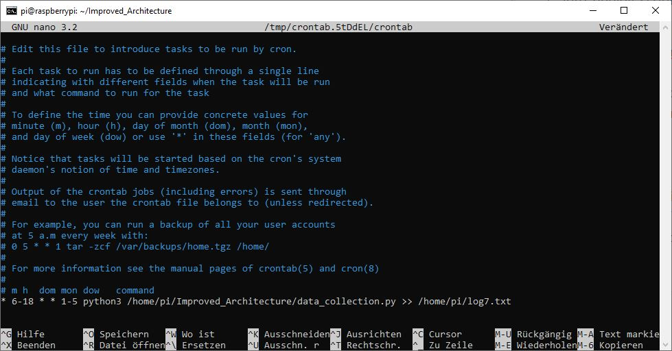

# Deployment Script

The deployment script have been set up for the following features:

1. **auto_deploy_script.py**

In order to deploy the same version of code into multiple raspberries with single command, we have been using paramiko library(python). This library implements SSHv2 protocol, providing client-server functionality. The main advantage of using this library is that it helps to execute the remote shell commands and also for transferring files to raspberry. The detailed description of the library can be read using the link [paramiko](https://www.paramiko.org/)

2. **crontab**

Crontab in Linux:
Linux system has inbuilt system program Cron. It is used for scheduling program scripts that run automatically at specified date time intervals in recurring cycles. The Cron jobs can be specified with the following set of commands.

**Setting up of crontab:**

~~~shell

pi@raspberrypi:~$ crontab -e

~~~

As soon as the command is executed, you will be asked to choose the text editor of your choice. 

**Syntax for crontab:**

```shell
* * * * * /path to the script.py
```

Each of the fields corresponds to the following meaning:

**[Minute] [hour] [Day_of_the_Month] [Month_of_the_Year] [Day_of_the_Week] [command]**

Minute 0 – 59

Hour 0 – 23

Day of month 1 – 31

Month of year 1 – 12

Day of week 0 – 7

**Sample crontab:**



The above command runs the task during the working days(Monday to Friday) every minute from 6 am until 6pm.

The python script data_collection.py is deployed into raspberry using paramiko and is run continuously using crontab.

The output of the script can be viewed by logging it to the text file as described in the above image.

3. **docker container setup:**

   docker container is a software that packages the code and its dependencies in order to run the application quickly in different environment.

   the web server and grafana is set up in docker container and deployed into the server.

   the commands used to set up the docker container are as follows:

   Pre-requisites:

   1. Dockerfile

   set up the working directory 

   2. requirements.txt

   specify all the required libraries for the project 

   3. docker-compose.yml

      set up the services and create images for each services with port number and volumes for container.

      

   Once the project with docker set up is ready run the following commands to set up the container in local environment.

   Navigate to project directory and execute from CLI:

    ```shell
    #build
    docker-compose build
    python build_database.py
    docker-compose up
    docker-compose exec simplerest python build_database.py
    ```

   To do clean restart of docker instance

   ```shell
   #stop the container
   docker-compose down
   #restart container
   docker-compose up -d
   ```

   

