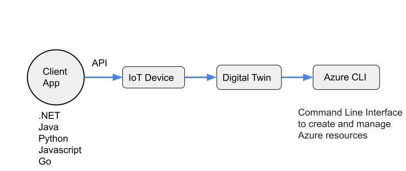

# Send Data from IoT Hub to Azure Digital Twin 


**Introduction**

This project briefly describes about creation of IoT Hub, digital twin and communication between them. The main goal is to measure and predict COVID-19 risk with mock up sensor data. In this project, we will send data to IoT device which updates the Digital Twin.

In this sample, we are sending data to IoT device **Raspberry1** which is in Lobby100

[DL] We could use a "running example" here - e.g. send co2 values for Raspi1 which is in Room101. Then, you can reference in the description the specific names. Example: The device created in IoT-Hub ("Raspi1" in our example).
**Prerequisites Resources**

The following resources have to be set up in advance to send the data from IoT Hub to Digital Twin instance.

1. Azure account subscription
2. IoT Hub 
3. Azure Digital Twin

[DL] We can set a link here to the readme file where the creation of the azure account is described
[DL] I would describe the Setup of IoT-Hub in Azure Part of the documentation, and then say that a prerequisite is that the IoT-Hub must be set up.

[DL] We can also set links to the tools here.

   **Workflow**



**Client App for Mock-up data generation**

Prepare the client application to send mock-up telemetry data to the created IoT device
[DL] we have to put the code for this client app into this github folder, and then reference the files from here
[DL] Then, we can first describe the adaptations that a user has to do after downloading the code, and then which commands has to be entered in order to send example data to the created service. So basically what you've already done, but with the reference to the code as a downloadable file
[DL] What about the script that creates Digital Twins in Azure (this is also a prerequisite for sending data).

1. Required libraries:

   1.a) azure.iot.device

   The client app could be developed using any of the languages Python, C#, Java, JavaScript Go. We are using Python to create the client app and the script is as follows.

   The client app is connected with IoT device using the device connection string, replace the **connection string** property with your own IoT device primary connection string to which the telemetry data is to be sent.

**Get the IoT device connection string**

Go to IoT Hub ---> click on specific IoT device to which you need to send data ---> detailed view of IoT device with properties such as device id, primary and secondary key etc


copy paste the connection string into the python script.

python function description:

1. iothub_client_init()

Initializes the Azure IoT Hub 

2. iothub_client_telemetry_sample_run()

if client is initialized then set up  telemetry data properties with random values

Telemetry properties :

1. Temperature

2. Humidity

3. CarbonDioxideValue

   **Run the Client App**

   Using windows command line navigate to the python file  [SimulatedDevice.py](https://github.com/derlehner/DigitalTwin_Airquality_For_Covid_Risk_Assessment/tree/development/physical_twin/simulated_hardware/SimulatedDevice.py)

   Run python script with command line interface
   
   ```python
   python {filename.py}
   ```

   **Output of the Client App**
   
   


**Testing the Client App:**

**Method-1:** IoT Hub Overview

To verify if the telemetry data is sent to Azure IoT Device , there are metrics charts in IoT hub that shows the incoming device to cloud messages, messages used per day etc


**Method-2:** Azure CLI

Open the cloud shell from Azure portal and you need to create storage account when using it for first time.

Two cloud shells are present you can use either of them to test

1. PowerShell -command line for **windows** and 

2. Bash- command line for **Linux** operating system

   Install extensions in Azure CLI before using IoT commands

   **Required Extensions:**

   1. azure iot extension

   ```python
   az extension add --name azure-iot
   ```

   **Monitor the events of IoT Hub device**

   ```python
   az iot hub monitor-events --hub-name {iot hub name} --device-id {digital twin name} --consumer-group {consumer group name of iot hub events}
   ```

   Replace the IoT Hub name, digital twin name and consumer group name accordingly.

   We can see that telemetry data sent from client app is received in the Azure IoT digital twin model

   


