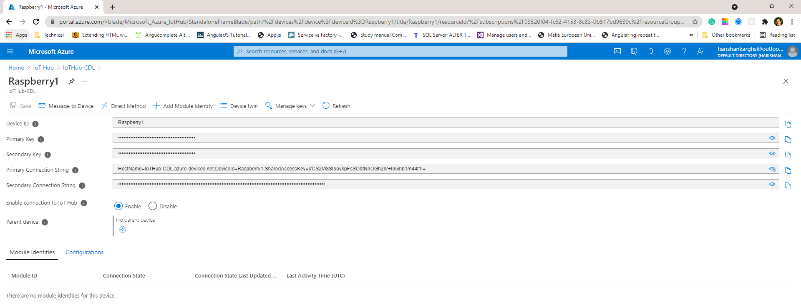
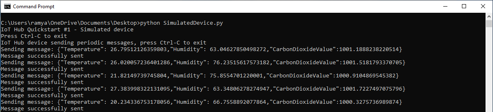
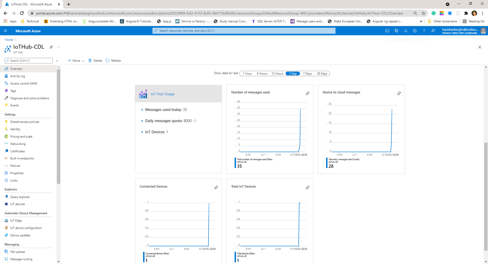

# Simulate Hardware with Actual Sensor Values

This project briefly describes about creation of IoT Hub, digital twin and communication between them. The main goal is to measure the air quality in indoor environment and update the IoT devices with measurements. This project uses the air quality measurements from room. Now let us see how we can send these sensor data to IoT device which updates the Digital Twin.
In this sample, we are sending sensor data to IoT device **Raspberry1** which is in room Lobby100
## Prerequisites

In order to send data to the Digital Twin of Lobby100 and Raspberry1, we need to set up the corresponding Digital Twin infrastructure and the respective Digital Twins. The documentation for that is give in the [folder digital_twin of this repository](https://github.com/derlehner/IndoorAirQuality_DigitalTwin_Exemplar/tree/main/digital_twin).

More specifically, we need the following prerequisites to be met:
1. IoT-Hub, ADT-Service, TSI-Service are set up
2. The services above are connected via the respective Azure functions
3. A Digital Twin for Lobby100 and Raspberry1 is created in all of these services, using the example data provided in the [digital_twin folder](https://github.com/derlehner/IndoorAirQuality_DigitalTwin_Exemplar/tree/main/digital_twin)

## Send simulated data to the Digital Twin
To send the simulated data, we provide an example client app coded in Python, which is available via the following link: [SimulatedDevice.py](https://github.com/derlehner/IndoorAirQuality_DigitalTwin_Exemplar/blob/main/physical_twin/simulated_hardware/SimulatedDevice.py)
In order to run the app, we need to install required packages via the following command

```
pip install azure.iot.device
```

The configuration and running of the example client app is described in the following.

### Configuring the client app

Download the python script [SimulatedDevice.py](https://github.com/derlehner/IndoorAirQuality_DigitalTwin_Exemplar/blob/main/physical_twin/simulated_hardware/SimulatedDevice.py) and replace the **connection string** property with your own IoT device primary connection string to which the telemetry data is to be sent.

**Get the IoT device connection string**

Go to IoT Hub ---> click on specific IoT device to which you need to send data ---> detailed view of IoT device with properties such as device id, primary and secondary key etc



copy paste the connection string into the python script.

**Sensor data in csv file**

We have used the actual sensor data obtained from an SCD30 sensor which is set up in a room at our organization to send data to virtual room "Lobby100". The timespan of the dataset is seven day interval. The data was collected when almost two persons were working in room during daytime. The sensor data is exported into csv file [SensorData.csv](https://github.com/derlehner/IndoorAirQuality_DigitalTwin_Exemplar/blob/main/physical_twin/simulated_hardware/sensorData.csv) and parsed to get co2 measurements. The  measurements are then sent to Azure IoT devices. you can use the existing csv file for sensor data or replace with your own csv file with actual or mock up sensor values.

### Run the client app

Using windows command line navigate to the folder in which the SimulatedDevice.py file is located (if you cloned the repository, then this is the current folder that you're in) python file. To run the app, execute the following command via the command line in this folder:
```python
python SimulatedDevice.py
```
**Example Output of the Client App**



## Testing the client app:
To validate the correct functioning of the app (or debug in the case of errors), two methods are possible:

**Method-1:** IoT Hub Overview

To verify if the telemetry data is sent to Azure IoT Device , there are metrics charts in IoT hub that shows the incoming device to cloud messages, messages used per day etc




**Method-2:** Azure CLI

Open the cloud shell from Azure portal and you need to create storage account when using it for first time.

Two cloud shells are present you can use either of them to test

1. PowerShell -command line for **windows** and 

2. Bash- command line for **Linux** operating system

   Install extensions in Azure CLI before using IoT commands

   **Required Extensions:**

   1. azure iot extension

   ```python
   az extension add --name azure-iot
   ```

   **Monitor the events of IoT Hub device**

   ```python
   az iot hub monitor-events --hub-name {iot hub name} --device-id {digital twin name} --consumer-group {consumer group name of iot hub events}
   ```

   Replace the IoT Hub name, digital twin name and consumer group name accordingly.

   We can see that telemetry data sent from client app is received in the Azure IoT digital twin model

   


