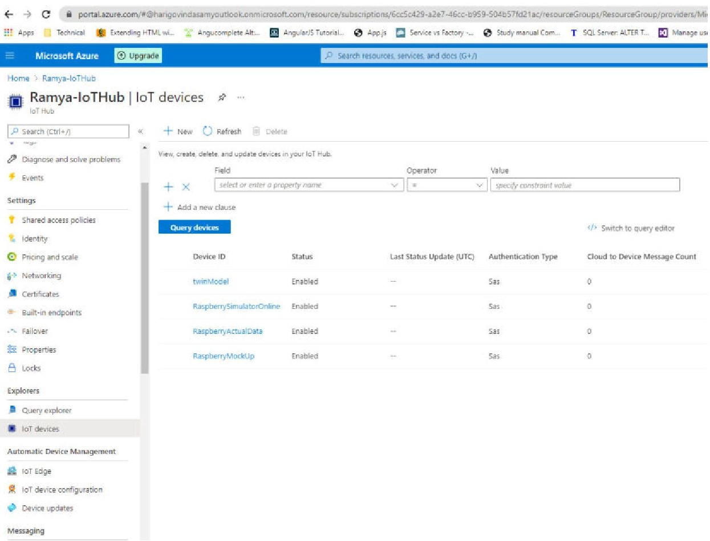
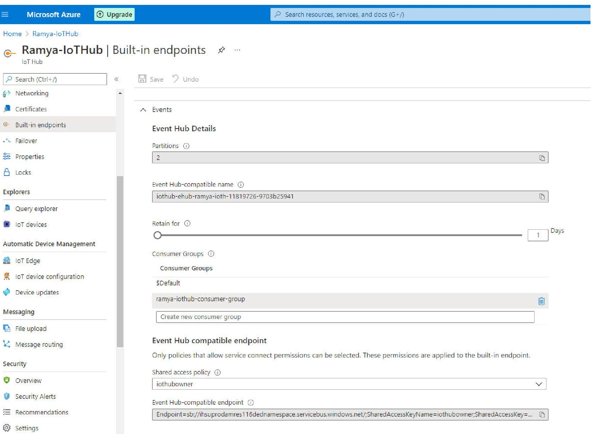
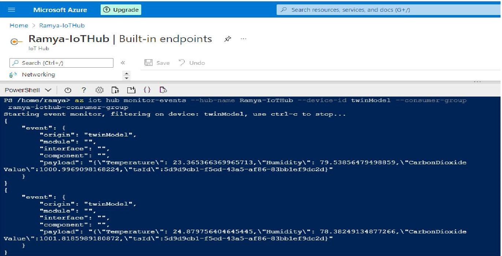

# Send Data from IoT Hub to Azure Digital Twin 


**Introduction**

This project briefly describes about creation of IoT Hub, digital twin and communication between them. The main goal is to measure and predict COVID-19 risk with mock up sensor data. In this project, we will set up IoT hub and Azure Digital Twin and send telemetry data from IoT device to Digital Twin
[DL] We could use a "running example" here - e.g. send co2 values for Raspi1 which is in Room101. Then, you can reference in the description the specific names. Example: The device created in IoT-Hub ("Raspi1" in our example).
**Prerequisites**

Azure account subscription
[DL] We can set a link here to the readme file where the creation of the azure account is described
[DL] I would describe the Setup of IoT-Hub in Azure Part of the documentation, and then say that a prerequisite is that the IoT-Hub must be set up.

**Resources**

1. IoT Hub

2. Azure Digital Twin

[DL] We can also set links to the tools here.

**IoT Hub Setup:**

what is IoT Hub?

**IoT Hub** is a Platform-as-a-Services (PaaS) managed service, hosted in the cloud, that acts as a central message **hub** for bi-directional communication between an **IoT** application and the devices it manages

1. Create a new resource, IoT Hub by typing in the search bar,create new resource group for managing all the azure resources.

Create IoT Hub by specifying subscription, resource group, region and assign IoT hub name

**Azure Digital Twin**

what is Azure Digital Twin?

Azure Digital Twin is an Internet of Things (IoT) platform that enables users to create digital representation of real-world things and monitor the asset, component or process in real-time

   **Workflow**


**IoT Hub Setup**

1. Create a new resource IoT Hub by typing in the search bar,we require resource group for managing all the azure resources, if it not created then create new resource group and add IoT Hub to the resource group. Choose your Azure subscription, resource group, region and assign IoT Hub name


2. Create IoT device in IoT Hub, provide device id name , for instance we have assigned device id as twinModel, After successful creation, list of IoT devices appears as shown below

   




3. Create a separate consumer group for IoT Hub to send data from IoT Hub to other cloud resources. Go to IoT Hub → Built-in endpoints → Events and create consumer group under Events section

   


**Client App for Mock-up data generation**

Prepare the client application to send mock-up telemetry data to the created IoT device
[DL] we have to put the code for this client app into this github folder, and then reference the files from here
[DL] Then, we can first describe the adaptations that a user has to do after downloading the code, and then which commands has to be entered in order to send example data to the created service. So basically what you've already done, but with the reference to the code as a downloadable file
[DL] What about the script that creates Digital Twins in Azure (this is also a prerequisite for sending data).

1. Required libraries:

   1.a) azure.iot.device

   The client app could be developed using any of the languages Python, C#, Java, JavaScript Go. We are using Python to create the client app and the script is as follows.

   ```python
   import random
   import time
   from azure.iot.device import IoTHubDeviceClient, Message
   # The device connection string to authenticate the device with your IoT hub.
   # Using the Azure CLI:
   # az iot hub device-identity show-connection-string --hub-name {YourIoTHubName} --device-id MyNodeDevice --output table
   CONNECTION_STRING = "HostName=Ramya-IoTHub.azure-devices.net;DeviceId=twinModel;SharedAccessKey=KzmFZY2yj889Yc3t64wX8WFcEJMwOrxhVWnlKk7ezB4="
   
   # Define the JSON message to send to IoT Hub.
   TEMPERATURE = 20.0
   HUMIDITY = 60
   CARBONDIOXIDE=1000
   TSID="5d9d9cb1-f5cd-43a5-af86-83bb1ef9dc2d"
   MSG_TXT = '{{"Temperature": {Temperature},"Humidity": {Humidity},"CarbonDioxideValue":{CarbonDioxideValue},"tsId":{tsId}}}'
   
   def iothub_client_init():
       # Create an IoT Hub client
       client = IoTHubDeviceClient.create_from_connection_string(CONNECTION_STRING)
       return client
   
   def iothub_client_telemetry_sample_run():
   
       try:
           client = iothub_client_init()
           print ( "IoT Hub device sending periodic messages, press Ctrl-C to exit" )
   
           while True:
               # Build the message with simulated telemetry values.
               Temperature = TEMPERATURE + (random.random() * 15)
               Humidity = HUMIDITY + (random.random() * 20)
               CarbonDioxideValue=CARBONDIOXIDE+(random.random()*2)
               tsId=TSID
               msg_txt_formatted = MSG_TXT.format(Temperature=Temperature, Humidity=Humidity,CarbonDioxideValue=CarbonDioxideValue,tsId=tsId)
               message = Message(msg_txt_formatted)
   
               # Add a custom application property to the message.
               # An IoT hub can filter on these properties without access to the message body.
               if Temperature > 30:
                 message.custom_properties["temperatureAlert"] = "true"
               else:
                 message.custom_properties["temperatureAlert"] = "false"
   
               # Send the message.
               print( "Sending message: {}".format(message) )
               client.send_message(message)
               print ( "Message successfully sent" )
               time.sleep(1)
   
       except KeyboardInterrupt:
           print ( "IoTHubClient sample stopped" )
   
   if __name__ == '__main__':
       print ( "IoT Hub Quickstart #1 - Simulated device" )
       print ( "Press Ctrl-C to exit" )
       iothub_client_telemetry_sample_run()
   
   ```

   

The client app is connected with IoT device using the device connection string,replace the connection string property with your own  IoT device primary connection string of the to which the telemetry data is to be sent.

**Get the IoT device connection string**

Go to IoT Hub ---> click on specific IoT device to which you need to send data ---> detailed view of IoT device with properties such as device id, primary and secondary key etc


copy paste the connection string into the python script.

python function description:

1. iothub_client_init()

Initializes the Azure IoT Hub 

2. iothub_client_telemetry_sample_run()

if client is initialized then set up  telemetry data properties with random values

Telemetry properties :

1. Temperature

2. Humidity

3. CarbonDioxideValue

   

   **Run the Client App**

   Using windows command line navigate to the python file and run python script with command

   ```python
   python {filename.py}
   ```

   **Output of the Client App**

   


**Testing the Client App:**

**Method-1:** IoT Hub Overview

To verify if the telemetry data is sent to Azure IoT Device , there are metrics charts in IoT hub that shows the incoming device to cloud messages, messages used per day etc


**Method-2:** Azure CLI

Open the cloud shell from Azure portal and you need to create storage account when using it for first time.

Two cloud shells are present you can use either of them to test

1. PowerShell -command line for **windows** and 

2. Bash- command line for **Linux** operating system

   Install extensions in Azure CLI before using IoT commands

   **Required Extensions:**

   1. azure iot extension

   ```python
   az extension add --name azure-cli-iot-ext
   ```

   **Monitor the events of IoT Hub device**

   ```python
   az iot hub monitor-events --hub-name {iot hub name} --device-id {digital twin name} --consumer-group {consumer group name of iot hub events}
   ```

   Replace the IoT Hub name, digital twin name and consumer group name accordingly.

   We can see that telemetry data sent from client app is received in the Azure IoT digital twin model

   


## **Create Azure Digital Twin Model and Send Telemetry data from Azure Digital Twin to Time Series Instance **

### **Introduction**

This project aims to create Azure Digital Twin Model and send Telemetry data from model to the Time Series Instance.

**Workflow**


### **Why Azure Digital Twin ?**

The main advantage of using Azure Digital Twin is that we can define our own model and twin graph based on our needs. We can create Digital Twin with these models. Azure Digital Twins models are represented in the JSON-LD-based **Digital Twin Definition Language (DTDL)**.

### **Models**

Models have names (such as *Room* or *TemperatureSensor*), and contain elements such as properties, telemetry/events, and commands that describe what this type of entity in your environment can do

### **Digital Twin Definition Language (DTDL) for models**

Models for Azure Digital Twins are defined using the Digital Twins Definition Language (DTDL).

You can view the full language specs for DTDL in GitHub: [Digital Twins Definition Language (DTDL) - Version 2](https://github.com/Azure/opendigitaltwins-dtdl/blob/master/DTDL/v2/dtdlv2.md)

### **Model Overview-Elements of a Model**

A DTDL model interface may contain the following fields:

- **Property** - Properties are data fields that represent the state of an entity. Properties have backing storage and can be read at any time.
- **Telemetry** - Telemetry fields represent measurements or events, and are often used to describe device sensor readings.  Telemetry is not stored on a digital twin, it is a series of time-bound data events that need to be handled as they occur.
- **Relationship** - Relationships let you represent how a digital twin can be involved with other digital twins. Relationships can represent different semantic meanings, such as *contains* ("Building contains floor"). Relationships can have the properties of their own and allow the solution to provide a graph of interrelated entities. 
- **Component** - Components allow you to build your model interface as an assembly of other interfaces. An example of a component is a *frontCamera* interface (and another component interface *backCamera*) that are used in defining a model for a *phone*. You must first define an interface for *frontCamera* as though it were its own model, and then you can reference it when defining *Phone*.

### **Model Code**

Twin type models can be written in any text editor. The DTDL language follows JSON syntax ,so store models with the extension .json

**Model Fields**

| Field       | Description                                                  |
| ----------- | ------------------------------------------------------------ |
| @id         | An identifier for the model. Must be in the format `dtmi:<domain>:<unique-model-identifier>;<model-version-number>`. |
| @type       | Identifies the kind of information being described. For an interface, the type is *Interface*. |
| @context    | Sets the [context](https://niem.github.io/json/reference/json-ld/context/) for the JSON document. Models should use `dtmi:dtdl:context;2`. |
| displayName | [optional] Allows you to give the model a friendly name if desired. |
| contents    | All remaining interface data is placed here, as an array of attribute definitions. Each attribute must provide a `@type` (**property**, **telemetry**, **command**, **relationship**, or **component**) to identify the sort of interface information it describes, and then a set of properties that define the actual attribute (for example, `name` and `schema` to define a **property**). |

### **1. Creation of Models for Azure Digital Twin** 

**Go to project folder**→**Digital Twin→Cloud**→**interface_models**

We have the sample model interface with attributes component, telemetry and relationship between them

AirQualityController.json

```json
{
	"@type": "Interface",
	"displayName": "AirQualityController",
	"comment": "This is a comment",
	"@id": "dtmi:org:example:AirQualityController;2",
	"contents":[
			{
			"@type": ["Component"],
			"name": "CO2Sensor",
			"displayName": "CO2Sensor",
			"@id": "dtmi:org:example:a;2",
			"schema": "dtmi:org:example:cotwoSensor;2"
			}
	],
	"@context": "dtmi:dtdl:context;2"
}

```

AirQualitySensor.json

```json
{
	"@type": "Interface",
	"displayName": "AirQualitySensor",
	"@id": "dtmi:org:example:cotwoSensor;2",
	"contents":[
			{
			"@type": [
				"Telemetry"
			],
			"schema": "double",
			"displayName": "carbonDioxideValue",
			"@id": "dtmi:org:example:cotwoSensor:cotwoValue;2",
			"name": "carbonDioxideValue"
			},
			{
			"@type": [
				"Property"
			],
			"schema": "string",
			"displayName": "type",
			"@id": "dtmi:org:example:cotwoSensor:type;2",
			"name": "type"
			}
	],
	"@context": "dtmi:dtdl:context;2"
}

```

Room.json

```json
{
	"@type": "Interface",
	"displayName": "Room",
	"@id": "dtmi:com:example:Room;2",
	"contents":[
			{
			"@type": ["Relationship"],
			"displayName": "airQualityControllers",
			"@id": "dtmi:org:example:whatever;2",
			"target": "dtmi:org:example:AirQualityController;2",
			"minMultiplicity": 0,
			"writable": true,
			"properties": [
				{
				"@type": [
					"Property"
				],
				"schema": "boolean",
				"displayName": "room",
				"name": "room"
				}
			],
			"name": "airQualityControllers"
			}
	],
	"@context": "dtmi:dtdl:context;2"
}

```

### **2. Creation of Digital Twin Models** 

**Go to project folder**→**Digital Twin→Cloud**→**twin_models**

we have the sample code for creating a Digital Twin and relationship for the model 

Raspberry1.json

```json
{
    "dtid": "Raspberry1",
    "content": {
        "$metadata": {
            "$model": "dtmi:org:example:AirQualityController;2"
        },
        "CO2Sensor": {
            "$metadata":{
            },
            "type": "testType"
        }
    }

}
```

Room101.json

```json
{
    "dtid": "Room101",
    "content": {
        "$metadata": {
            "$model": "dtmi:com:example:Room;2"
        }
    },
    "relationships":[
        {
            "id": "rel2",
            "content":{
                "$targetId": "Raspberry2",
                "$relationshipName": "airQualityControllers"
            }
        }
    ]

}
```

### **3.Generate Mock-up Telemetry Data**

**Go to project folder**→**Digital Twin→Cloud**→**telemetry_data**

we have the sample telemetry data that is to be sent to Azure Digital Twin in testdata.json file .The telemetry data contains attributes dtid, component and content with properties like carbonDioxideValue and timestamp value that needs to be updated in Azure Digital Twin

 ```json
  {
        "dtid": "Raspberry1",
        "componentId": "CO2Sensor",
        "content":{
            "carbonDioxideValue": 1000,
            "timestamp":"2021-05-12T12:53Z"
        }
    }
 ```

### **4. Create and Update Azure Digital Twin with Telemetry Data  **

**Go to project folder**→**Digital Twin→Cloud**

The folder contains the files for performing CRUD operations on Digital Twin with Telemetry Data

**Files used :**

| FileName            | Functionalities                                              |
| ------------------- | ------------------------------------------------------------ |
| digital_twin_api.py | functions for performing CRUD operations on Digital Twin with Telemetry Data |
| test.py             | call functions of digital_twin_api for creating interface and instances of Digital Twin |
| process.py          | import test.py and calls function to send telemetry data to digital twin |

Now let's look into each of them in detail

1. **digital_twin_api.py**

   Replace base_url and auth_token for accessing Azure Digital Twin resource 

   a) Go to Azure Digital Twin and copy the host name ,this is to be added as base_url string

   

   

   b) Generate auth_token from Azure CLI 

   Prerequisites:

   1.Install Azure CLI on windows 

   a) Open Microsoft Azure Command Prompt in windows and enter command below logging into your Azure account

   

   b) Generate Access Token using the command(resource id differs for each account)

   az account get-access-token --resource {resource id}

   ```bash
   az account get-access-token --resource 0b07f429-9f4b-4714-9392-cc5e8e80c8b0
   ```

   

   Update the auth_token in digital_twin_api.py file

2. **test.py**

The python script has functions for performing following operations:

function calls for digital_twin_api.py file is done here and we pass arguments for each of them

**Prerequisites:**

import digital_twin_api 

**Python libraries used** 

1. json

2. urllib3

a) Creating structure of Telemetry Data and its properties 

 **create_schema()**

Create Digital Twin interface with created models from folder(interface_models) , we load the created models and call the function **create_interface** in digital_twin_api.py from test.py

 b) Creating API instances of digital twin 

 **create_instances()**

we load the created twin models from folder (twin_models) and call function **create_twin** for creating Digital Twin and **create_relationship** for creating relationships between twins

c) Sending telemetry data 

 **send_telemetry_data()**

we load the sample telemetry data from folder(telemetry_data) and pass as arguments the function **send_telemetry_for_component** in digital_twin_api

d) Clean-up function for deleting the digital twin relationships 

**cleanup()**

You can decide which resources are needed and use it for future. Remove other resources when not in use by deleting the Digital twin , its relationship and interface 

```python
import digital_twin_api
import tsi_api
import urllib3
import json

urllib3.disable_warnings(urllib3.exceptions.InsecureRequestWarning)


interface_file_names = ["Room", "AirQualitySensor", "AirQualityController"]
twin_file_names = ["Raspberry1", "Raspberry2", "Raspberry3",
                    "Room101", "Room102", "Lobby100"]
delete_interface_ids = ["dtmi:com:example:Room;2", "dtmi:org:example:AirQualityController;2", "dtmi:org:example:cotwoSensor;2"]
delete_relationship_ids = [("Lobby100", "rel1"), ("Room101", "rel2"), ("Room102", "rel3"), ("Room102", "rel4")]
delete_dtids = ["Room101", "Room102", "Lobby100",
                    "Raspberry1", "Raspberry2", "Raspberry3"]

def create_schema():
    for file_name in interface_file_names:
        interface_to_create = None
        with open("interface_models/" + file_name + ".json") as tc_file:
            interface_to_create = json.load(tc_file)
        digital_twin_api.create_interface(interface_to_create)
        # create type in tsi
        telemetries = {}
        print("Interface " + interface_to_create["displayName"])
        for content in interface_to_create["contents"]:
            if(content["@type"][0] == "Telemetry"):
                tsx = "$event." + content["displayName"]
                if(content["schema"] == "double"):
                    tsx += ".Double"
                else:
                    tsx += ".Long"
                telemetries[content["displayName"]] = {
                    "kind": "numeric",
                    "value": {
                        "tsx": tsx
                    },
                    "aggregation": {
                        "tsx": "avg($value)"
                    }
                }

        interface = {
            "id": interface_to_create["@id"],
            "name": interface_to_create["displayName"],
            "variables": telemetries
        }
        tsi_api.create_interface(interface)

def create_instances():
    for file_name in twin_file_names:
        twin_to_create = None
        with open("twin_models/" + file_name + ".json") as tc_file:
            twin_to_create = json.load(tc_file)
        # create digital twin in azure
        digital_twin_api.create_twin(twin_to_create["dtid"], twin_to_create["content"])
        # create outgoing relationships in azure
        if "relationships" in twin_to_create.keys():
            for rel in twin_to_create["relationships"]:
                digital_twin_api.create_relationship(twin_to_create["dtid"], rel["id"], rel["content"])

def send_telemetry_data():
    # send telemetry data
    values = None
    with open("telemetry_data/" + "testdata" + ".json") as tc_file:
        values = json.load(tc_file)
    for telemetry_value in values:
        dtid = telemetry_value["dtid"]
        component_name = telemetry_value["componentId"]
        telemetry = telemetry_value["content"]
        digital_twin_api.send_telemetry_for_component(dtid, component_name, telemetry)

def cleanup():
    # cleanup
    for rel in delete_relationship_ids:
        digital_twin_api.delete_relationship(rel[0], rel[1])
    for dtid in delete_dtids:
        digital_twin_api.delete_twin(dtid)
    for interface_id in delete_interface_ids:
        digital_twin_api.delete_interface(interface_id)
```


3.**process.py**

This function imports the test.py file and calls the function send_telemetry_data for sending telemetry data to Digital Twin

```python
import test
import urllib3

urllib3.disable_warnings(urllib3.exceptions.InsecureRequestWarning)
test.send_telemetry_data()
```

### **5. Run the API**

Navigate to the folder and run the python file 

**Go to project folder**→**Digital Twin→Cloud**


### **6. Azure Function to Send Telemetry Data to TSI  **

Azure functions is a serverless concept of cloud native design that allows a piece of code deployed and execute without any need of server infrastructure, web server, or any configurations. Azure functions can be written in multiple languages such as C#, Java, JavaScript, TypeScript, and Python

We are using C# language as it has predefined project template for creating the Azure Function.

Azure function supports Event Hub Trigger and is executed automatically when event is fired from Azure Digital Twin

**Create new Event Hub namespace in Azure**

Search for event hub and create new Event Hub namespace with name and resource group. Event Hub namespace will receive events from your Azure Digital Twins instance


You'll be using this event hubs namespace to hold the two event hubs:

1. **Twins hub** - Event hub to receive twin change events

2. **Time series hub** - Event hub to stream events to Time Series Insights

   **1. Create Twins Hub**

   Create new Event Hub  inside Event Hub namespace by clicking add button

   

   

   

   This event hub will receive twin change events from Azure Digital Twins. To set up the twins hub, you'll complete the following steps in this section:

   1. Create an authorization rule to control permissions to the hub

   2. Create an endpoint in Azure Digital Twins that uses the authorization rule to access the hub

   3. Create a route in Azure Digital Twins that sends twin updates event to the endpoint and connected twins hub

   4. Get the twins hub connection string  

   **a) Create twins hub authorization rule**

   Go to the created event hub inside the event hub namespace and select shared access policies from side menu and click on add button for creating new authorization policy and choose Send and Listen for the authorization rule as highlighted below

   

   **b) Create twins hub endpoint**

   Create an Azure Digital Twins endpoint that links your event hub to your Azure Digital Twins instance. Specify a name for your twins hub endpoint.

   Go to Digital Twin and choose Endpoints from side menu 

   **Endpoint type**- choose Event Hub

   **Subscription**- choose your azure subscription

   **Event hub namespace** **and** **Event Hub**- choose already created event hub namespace and event hub name

   **Authentication type**- key based

   **Authorization rule**- choose already created twin hub authorization rule

   

   **c) Create twins hub event route**

   Azure Digital Twins instances can emit twin update events whenever a twin's state is updated. In this section, you'll create an Azure Digital Twins **event route** that will direct these update events to the twins hub for further processing.

   Create a route in Azure Digital Twins to send twin update events to your endpoint from above. The filter in this route will only allow twin update messages to be passed to your endpoint. Specify a name for the twins hub event route.

   

   choose already created endpoint name

   

   **d) Get twins hub connection string**

   Go to the event hub namespace and click on the created twins hub below , choose shared access policies and click on created twins hub authorization rule , you can see the detailed view , copy the primary connection string as highlighted in the below image

   

   **2. Create time series hub**

   similar to twins hub create time series hub inside the existing event hub namespace

   **a) Create time series hub authorization rule**

   Go to the created time series hub  inside the event hub namespace and select shared access policies from side menu and click on add button for creating new authorization policy and choose Send and Listen for the authorization rule as highlighted below 

   

   **b) Get time series connection string**

   Go to the event hub namespace and click on the created time series hub below , choose shared access policies and click on created time series hub authorization rule , you can see the detailed view , copy the primary connection string as highlighted in the below image

   

make a note of both the twin and time series hub connection string to use them in tha Azure function below.

**Create Azure Function C#**

1. Create Azure Function with Event Hub Trigger

   a) Create a new C# project and choose Azure Function as Project template


​	  b) Choose the Event Hub trigger that runs whenever event is fired in Azure Digital Twin


**Go to project folder→code→AirQualityDataProcessing→AirQualityDataProcessing→ProcessDTTelemetryUpdateTSI.cs**

copy paste the contents from ProcessDTTelemetryUpdateTSI.cs to your new project or use the existing AirQualityDataProcessing project with solution file and set this as start-up project in visual studio.

**ProcessDTTelemetryUpdateTSI.cs**

Set up the connection string name for eventhub twins and time series insights according to your project. Provide the EventHubTrigger and EventHub with twin hub and time series hub name as we created earlier in Azure event hub namespace.


This Function gets the EventData from EventBus

Event data is in array segment and we parse to get the string

Convert JSON to .Net Object using (JObject) JsonConvert.DeserializeObject and cast it

Get properties out of the JSON Object

Serialize to JSON string and 

Add telemetry value to TSI (Time Series Instance)

Add a new json file **local.settings.json** with following information to the **AirQualityDataProcessing project**. 

Set the property name for twin and time series hub and add the primary connection string  obtained from Azure as follows

```json
{
  "IsEncrypted": false,
  "Values": {
    "AzureWebJobsStorage": "UseDevelopmentStorage=true",
    "FUNCTIONS_WORKER_RUNTIME": "dotnet",
    "AzureWebJobsDashboard": "UseDevelopmentStorage=true",
    "EventHubAppSetting-Twins": "Endpoint=sb://eventhubnamespace-ramya.servicebus.windows.net/;SharedAccessKeyName=twinHubAuthRule;SharedAccessKey=69U8vJHbaNdp4XrXFO/SRaplc6vu7hFTjXBcViwX1BY=;EntityPath=eventhub",
    "EventHubAppSetting-TSI": "Endpoint=sb://eventhubnamespace-ramya.servicebus.windows.net/;SharedAccessKeyName=timeseriesauthrule;SharedAccessKey=AtrIf6/ZgErjLm+8Pzu4ms3PEKuHNd+P+8VYAwdC5kE=;EntityPath=timeserieshub",
    "EventHubAppSetting-Twins-Structure": "Endpoint=sb://airqualitydatabus.servicebus.windows.net/;SharedAccessKeyName=automation;SharedAccessKey=Ayfn2C4d1sqF1RgZ0Vl488Ams2cH+K2Z8okQ/rsc8tI=;EntityPath=pushdtupdatetotsi",
    "EventHubAppSetting-TSI-Structure": "Endpoint=sb://airqualitydatabus.servicebus.windows.net/;SharedAccessKeyName=automation;SharedAccessKey=R+uyKaMQXS9FYjCUW1LVwk6IeFRNoEKgsqJLWnPXgJ0=;EntityPath=pulldtstructureupdates"

  }
}
```

Set up the connection string for EventHubAppSetting-Twins and EventHubAppSetting-TSI from Azure .

**Publish the Azure function** 

Right click on the C# project and choose publish  ,give the name for publishing and make a note for later use in this project, choose the resource group for Azure resources and finish , after successful publish, you see the image as shown below


**Verify the Azure function publish**

search for the function name in Azure that we set while publishing the function app from C#.If its successfully publish you will see the function app in the Azure 


**Set up security access for the function app**

To access Azure Digital Twins, your function app needs a system-managed identity with permissions to access your Azure Digital Twins instance.

Assign an access role for the function app so that it can access your Azure Digital Twins instance.

1.In the Azure portal, search for your function app by typing its name in the search box. Select your app from the results.

2.On the function app page, in the menu on the left, select **Identity** to work with a managed identity for the function. On the **System assigned** page, verify that the **Status** is set to **On**. If it's not, set it now and then **Save** the change.


 **Configure App Settings for the two Event Hubs**

To make the  function app accessible by twins hub and time series hub , you can set an environment variable in  function app's configuration.

In the Azure portal search for function app and select the function app from results.

Click on Configuration from side panel and click on button New Application setting,

Create two  environment variable one for twin and other for time series hub

**Twin Hub**

**Name**: connection string name for twin hub as we provided in the C# Azure function

**Value**: Use the twins hub **primaryConnectionString** value that you saved earlier when creating the shared access policies for twin hub. This connection string is also used in the local.settings.json file ,when we created Azure function app.  

**Time Series Hub**

**Name**: connection string name for time series hub as we provided in the C# Azure function

**Value**: Use the time series hub **primaryConnectionString** value that you saved earlier when creating the shared access policies for time series hub.


After adding the application settings for twin and time series hub, the result would be as shown below


**Azure Function Trigger**

The Azure function execution happens automatically,  when the Digital Twin receives update or add events

Debug the C# project and now you can see the output as shown below:
Carbondioxide value is read and logged , this mock-up data has been received from azure (By executing python process.py which sends telemetry data to azure)


